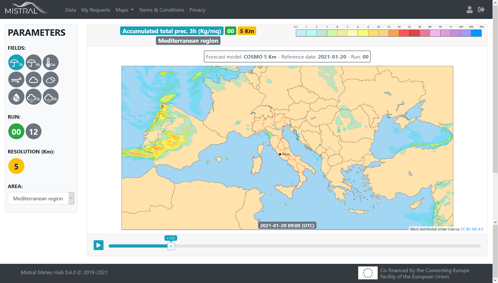

# **MISTRAL** Documentation


**Author**: CINECA

**Date**: 19 January 2021

**Status**: draft


------

**List of contents**

[TOC]

------


# **Web Frontend features**
## **Data**

### **Download open data**

For all users, even those not logged in, it is possible to download packages of open data. The packages are produced on a daily basis. The user must click on the icon marked by the red arrow in the following image:


A dialog window will open with the list of downloadable packages:


Currently this feature is available for the following datasets:

- Multimodel ensemble forecast by Arpa Piemonte
- Surface Rainfall Intensity from Radar-DPC
- Italy Flash Flood

The observations data is open, too. The user can download them in the map of observations.

### **Data Extraction**

The user can obtain data from one or more datasets of the platform through the Web Frontend feature of the Data Extraction.

In the first step, the user must select one or more datasets (multiple selection is allowed only with datasets of the same category: observation, forecast, radar).

In the second step, the user can filter respect the provided parameters that are specific for the dataset category:


| Category    | Filter                                                       |
| ----------- | :----------------------------------------------------------- |
| Observation | Reftime, Level, Product, Timerange                           |
| Forecast    | Reftime, Area, Level, Origin, Proddef, Product, Run, Timerange |
| Radar       | Reftime, Area, Level, Origin, Proddef, Product, Run, Timerange |

In the third step, the user can apply a set of post-processing that is specific for the dataset category:


| Category    | Post-processing                                              |
| :---------- | :----------------------------------------------------------- |
| Observation | Derived Variables, Time Post Processing, Quality Control Filter, Format Conversion |
| Forecast    | Derived Variables, Time Post Processing, Space Post Process  |
| Radar       | Derived Variables, Time Post Processing, Space Post Process  |

In the fourth and last step, the user must enter a name for the current request and submit the request to the system.

Before submitting the request, the user can schedule the request by clicking on the "Schedule" button and can redirect the result of the request to an AMQP queue through the switch “Data Pushing”.

In each step of the data extraction, it is possible to interrupt the creation of the current request by clicking on the Cancel button.
The user is brought back to the dataset selection page.


### **My Requests**

After submitting a request, the user is led to the "My Requests" page:


There is a list of all requests submitted by the user. The first request on the list is the one just submitted: the status is *PENDING* because the execution of the request is still in progress.

By clicking on the icon:


the information on the page is updated. When the status of the request becomes *SUCCESS*, it means that the execution has finished successfully.

The user can download the output data of the request by clicking the icon:


The user can expand the request box information by clicking the icon:


Moreover the user can delete a request by clicking the trash bin icon.

The situation of the user disk quota occupation is shown on the widget "Storage" on the left.

By clicking on the Schedules tab, the page will show the list of the scheduled requests of the user.
### **Scheduled queries**
*TODO Bea*

### **Data pushing**
First of all, the account must be enabled to the "Data pushing" feature. The user has to contact the Administrator to be enabled. The Administrator will enable the user to "Data pushing" and will create an AMQP queue for the user.

*TODO Bea*


------


## **Visualisation**

The MISTRAL web Frontend provides some tools for the visualization of observed and forecast data. They are available under the menu "Maps" and they are described in the following paragraphs.

### **Forecasts map**

Forecasts data from COSMO-5M and COSMO-2I models are displayed in this web visualisation tool. The meteorological fields are represented with raster map images in PNG format. These images are not geo-referenced and is not possible to change dynamically zoom during the visualization.



A sort of temporal animation was implemented showing the images in sequence (carousel).

It is possible to visualise only the data of the last two runs of the models: 00 and 12.


### **Italy Flash Flood map**

The same web visualisation tool, with raster map images in PNG format, has been used to display the Italy Flash Flood data:


Only visualisation of the last run data is available.

### **Observations map**

Observed data from ground stations are displayed on a customized web viewer developed for Mistral project: the measurements of the weather variables are visualized as geo-referenced markers over an Open Street Map layer. 


The user can filter by variable, date, Level, Time range, Network, Group of Licenses and Quality Control Filter.

The user can download the data filtered according to the selections set in the filter parameters. 

In addition, the viewer provides the meteograms of the data for each variable both at the single station level and at all stations selected at that time by the filter. 

The viewer also provides station displays.

### **Multi-layer map**

In the multi-layer visualization the data are represented on web tiled map, like the ones provided by OpenStreetMap. In this way the user is able to navigate and zoom the map and also to over-impose different meterological parameters.

The multi-layer visualisation is available for COSMO-5M, COSMO-2I and Italy Flash Flood data. Furthermore, the visualization of Arpa Piemonte's Multimodel data is available as geo-referenced markers on the map.


------


## **Admin guide**
*TODO Bea*

### **User roles**
The roles implemented are:

- *Administrators* 
- *Institutional*
- *User*

By assigning a role to an account, the Administrator enables that account to a certain profile and to a set of functionalities.

The functionalities for each profile are outlined in this *[table](https://gitlab.hpc.cineca.it/mistral/meteo-hub/-/issues/172#note_5812)*

The role *User* is the default one. It corresponds to the profile “Auto-registrato”. 

The Demo profile has the same permissions as the “Auto-registrato” profile and therefore it corresponds to the role *User*.

### **Create a new user**

*TODO* 

### **How To**
- **How to enable a user to “Data Pushing”**

To enable a user for "Data Pushing", the administrator must connect to the "Rabbit mq" console and create a dedicated AMQP queue for the user.

- **How to give a user access to a dataset**

The authorization to access a dataset is implemented at the user level: it is the administrator who enables each account to access certain datasets, at the time of creating the account or modifying it later.

The abilitation is managed in two ways:

- enabling access to all open datasets
- enabling additional datasets one by one


------


## **User guide**

*TODO Marghe*

### **User profile**
By clicking on the user profile icon, the Frontend shows to the user the list of information that make up the user's profile.

By clicking on the “Edit your profile” icon, users can modify some of the configurations of their profile: Name and Surname and “Requests expiration”. The “Requests expiration” parameter is described in the following paragraph.

Users can change their password by clicking on the button “CHANGE” near Last password change.
### **Requests expiration**
The “Requests expiration” parameter allows users to activate the automatic cleaning of their old submitted requests by setting the number N of days of expiration: requests with “End date” older than N days are deleted.

By default, N=0 that means the cleaning is not active.
### **Disk quota**

TODO

### **How To**

TODO

# **API**

*TODO Mattia*


# **Installation guide**
## **Data portal**
**TODO Giuse e Mattia: sarebbe meteo-hub*

### **Meteo Hub v0.4.0**

MeteoHub is a docker-based environment with many components orchestrated through the docker-compose utility framework. MeteoHub is implemented as an extension of the open source framework RAPyDo that implements core functionalities for most of the adopted services (Backend APIs, Frontend UI, Celery, RabbitMQ, Redis) and wraps the use of docker-compose.
To deploy MeteoHub a number of prerequisites are needed, in particular docker >= 17.05, python >= 3.6, git and the rapydo controller (usually installed with pip). Docker-compose is also required, but automatically installed with the controller.

The MeteoHub repository can be cloned from the Cineca Gitlab:

`$ git clone https://gitlab.hpc.cineca.it/mistral/meteo-hub.git`

Once installed docker, python and pip; the controller can ben installed as:

`$ sudo pip3 install rapydo`

to install the latest released version (at the time of writing the version 0.9, compatible with MeteoHub version 0.3.5), or:

`$ sudo pip3 install git+https://github.com/rapydo/do.git@1.0`

to install a specific version (at the time of writing version 1.0 is the latest development version, compatible with MeteoHub version 0.4.0)

Once installed any controller version, version incompatibilities can be detect by using the `rapydo version` command:

for example:
```
$ rapydo --version
rapydo version: 1.0

$ git branch --show-current 
0.3.5

$ rapydo version

rapydo: 1.0	mistral: 0.3.5	required rapydo: 0.9

This project is not compatible with rapydo version 1.0
Please downgrade rapydo to version 0.9 or modify this project

rapydo install 0.9

```

#### Development deployment
The following commands are required to configure and execute the stack in development mode:

To initialize the configuration:
`$ rapydo init`

This command will also create a .projectrc file with default settings

To pull the docker images required to the stack:

`$ rapydo pull`

To build the custom MeteoHub image:

`$ rapydo build`

To start the stack:

`$ rapydo start`

All services will automatically start, except for the REST APIs service that is required to be manually executed with:

`$ rapydo shell backend --default`

In another shell the container status and logs can be inspected by using docker commands or corresponding rapydo commands:

`$ docker logs mistral_frontend_1`
`$ rapydo -s frontend logs`

When the frontend compilation is completed the web interface will be available on localhost:80
APIs will respond on localhost:8080


#### Production deployment

To run the application in production mode an hostname should be assigned to the host, to properly create a valid SSL certificate (although the IP address can be used, in this case a self-signed certificate will be created)

The following commands are required to configure and execute the stack in production mode:

To initialize the configuration:

`$ rapydo --prod --hostname my.host.name init`

This command will also create a `.projectrc` file with default settings including enabled productin mode, provided hostname and random passwords for all the services. Feel free to change the random passwords with any other password you prefer (passwords will be injected on the services at the first run) by editing the `.projectrc` file

To pull the docker images required to the stack:

`$ rapydo pull`

To build the custom MeteoHub image:

`$ rapydo build`

To start the stack:

`$ rapydo start`

All services will automatically start, including an nginx reverse proxy. An ssl certificate will be automatically create by using Let's Encrypt.

The container status and logs can be inspected by using docker commands or corresponding rapydo commands:

```
$ docker logs mistral_frontend_1

or:

$ rapydo -s frontend logs
```

The web interface will be available on https://my.host.name
and APIs will respond on https://my.host.name/api

SSL certificates created with Let's Encrypt expire in 3 months and ca be renewed by using the command:

`$ rapydo ssl`

A crontab to automatize the certificate renewal should be considerd:

For example to renew every Monday at 00:00 AM

`0 0 * * 1 cd /your/project/path && COMPOSE_INTERACTIVE_NO_CLI=1 /usr/local/bin/rapydo ssl --no-tty > /your/project/path/data/logs/ssl.log 2>&1`


## **Open Data Catalogue**
### **Installing CKAN with docker compose**
The stack is based on Docker containers deployed with docker-compose, as described in the following documentation:

[https](https://docs.ckan.org/en/2.8/maintaining/installing/install-from-docker-compose.html)[://](https://docs.ckan.org/en/2.8/maintaining/installing/install-from-docker-compose.html)[docs](https://docs.ckan.org/en/2.8/maintaining/installing/install-from-docker-compose.html)[.](https://docs.ckan.org/en/2.8/maintaining/installing/install-from-docker-compose.html)[ckan](https://docs.ckan.org/en/2.8/maintaining/installing/install-from-docker-compose.html)[.](https://docs.ckan.org/en/2.8/maintaining/installing/install-from-docker-compose.html)[org](https://docs.ckan.org/en/2.8/maintaining/installing/install-from-docker-compose.html)[/](https://docs.ckan.org/en/2.8/maintaining/installing/install-from-docker-compose.html)[en](https://docs.ckan.org/en/2.8/maintaining/installing/install-from-docker-compose.html)[/2.8/](https://docs.ckan.org/en/2.8/maintaining/installing/install-from-docker-compose.html)[maintaining](https://docs.ckan.org/en/2.8/maintaining/installing/install-from-docker-compose.html)[/](https://docs.ckan.org/en/2.8/maintaining/installing/install-from-docker-compose.html)[installing](https://docs.ckan.org/en/2.8/maintaining/installing/install-from-docker-compose.html)[/](https://docs.ckan.org/en/2.8/maintaining/installing/install-from-docker-compose.html)[install](https://docs.ckan.org/en/2.8/maintaining/installing/install-from-docker-compose.html)[-](https://docs.ckan.org/en/2.8/maintaining/installing/install-from-docker-compose.html)[from](https://docs.ckan.org/en/2.8/maintaining/installing/install-from-docker-compose.html)[-](https://docs.ckan.org/en/2.8/maintaining/installing/install-from-docker-compose.html)[docker](https://docs.ckan.org/en/2.8/maintaining/installing/install-from-docker-compose.html)[-](https://docs.ckan.org/en/2.8/maintaining/installing/install-from-docker-compose.html)[compose](https://docs.ckan.org/en/2.8/maintaining/installing/install-from-docker-compose.html)[.](https://docs.ckan.org/en/2.8/maintaining/installing/install-from-docker-compose.html)[html](https://docs.ckan.org/en/2.8/maintaining/installing/install-from-docker-compose.html)

The following tools are required:

- **Docker Engine**: the containerization runtime

- **Docker Compose**: multi-container orchestration tool

The following container have been created:

| **Service Name**            | **image**                                          | **Network**           | **Volumes**                                                  | **notes**                                                    |
| :-------------------------- | :------------------------------------------------- | :-------------------- | :----------------------------------------------------------- | :----------------------------------------------------------- |
| webserver                   | nginx:alpine                                       | 80:8080<br />443:8443 | webserver\_config:/etc/nginx                                 | Reverse proxy, remaps:<br />/catalog -> ckan:5000<br />/datapusher -> datapusher:8800 |
| ckan                        | Built from source. v2.8.2                          | Internally on :5000   | ckan\_config: /etc/ckan<br />ckan\_home:/usr/lib/ckan<br />ckan\_storage:/var/lib/ckan | [https](https://github.com/ckan/ckan/tree/ckan-2.8.2)[://](https://github.com/ckan/ckan/tree/ckan-2.8.2)[github](https://github.com/ckan/ckan/tree/ckan-2.8.2)[.](https://github.com/ckan/ckan/tree/ckan-2.8.2)[com](https://github.com/ckan/ckan/tree/ckan-2.8.2)[/](https://github.com/ckan/ckan/tree/ckan-2.8.2)[ckan](https://github.com/ckan/ckan/tree/ckan-2.8.2)[/](https://github.com/ckan/ckan/tree/ckan-2.8.2)[ckan](https://github.com/ckan/ckan/tree/ckan-2.8.2)[/](https://github.com/ckan/ckan/tree/ckan-2.8.2)[tree](https://github.com/ckan/ckan/tree/ckan-2.8.2)[/](https://github.com/ckan/ckan/tree/ckan-2.8.2)[ckan](https://github.com/ckan/ckan/tree/ckan-2.8.2)[-2.8.2](https://github.com/ckan/ckan/tree/ckan-2.8.2) |
| db                          | Built from source, starting from *mdillon/postgis* | Internally on :5432   | pg\_data:/var/lib/postgresql/data                            | [https](https://hub.docker.com/r/mdillon/postgis)[://](https://hub.docker.com/r/mdillon/postgis)[hub](https://hub.docker.com/r/mdillon/postgis)[.](https://hub.docker.com/r/mdillon/postgis)[docker](https://hub.docker.com/r/mdillon/postgis)[.](https://hub.docker.com/r/mdillon/postgis)[com](https://hub.docker.com/r/mdillon/postgis)[/](https://hub.docker.com/r/mdillon/postgis)[r](https://hub.docker.com/r/mdillon/postgis)[/](https://hub.docker.com/r/mdillon/postgis)[mdillon](https://hub.docker.com/r/mdillon/postgis)[/](https://hub.docker.com/r/mdillon/postgis)[postgis](https://hub.docker.com/r/mdillon/postgis) |
| <p>solr</p><p> </p><p> </p> | Built from source, starting from *solr:6.6.2*      | Internally on :8983   |                                                              | [https](https://hub.docker.com/layers/solr/library/solr/6.6.2/images/sha256-02c52d10a1e0c505b203051c416b0fa16d3f0aed36ed5c71b83b4b492802eae5?context=explore)[://](https://hub.docker.com/layers/solr/library/solr/6.6.2/images/sha256-02c52d10a1e0c505b203051c416b0fa16d3f0aed36ed5c71b83b4b492802eae5?context=explore)[hub](https://hub.docker.com/layers/solr/library/solr/6.6.2/images/sha256-02c52d10a1e0c505b203051c416b0fa16d3f0aed36ed5c71b83b4b492802eae5?context=explore)[.](https://hub.docker.com/layers/solr/library/solr/6.6.2/images/sha256-02c52d10a1e0c505b203051c416b0fa16d3f0aed36ed5c71b83b4b492802eae5?context=explore)[docker](https://hub.docker.com/layers/solr/library/solr/6.6.2/images/sha256-02c52d10a1e0c505b203051c416b0fa16d3f0aed36ed5c71b83b4b492802eae5?context=explore)[.](https://hub.docker.com/layers/solr/library/solr/6.6.2/images/sha256-02c52d10a1e0c505b203051c416b0fa16d3f0aed36ed5c71b83b4b492802eae5?context=explore)[com](https://hub.docker.com/layers/solr/library/solr/6.6.2/images/sha256-02c52d10a1e0c505b203051c416b0fa16d3f0aed36ed5c71b83b4b492802eae5?context=explore)[/](https://hub.docker.com/layers/solr/library/solr/6.6.2/images/sha256-02c52d10a1e0c505b203051c416b0fa16d3f0aed36ed5c71b83b4b492802eae5?context=explore)[layers](https://hub.docker.com/layers/solr/library/solr/6.6.2/images/sha256-02c52d10a1e0c505b203051c416b0fa16d3f0aed36ed5c71b83b4b492802eae5?context=explore)[/](https://hub.docker.com/layers/solr/library/solr/6.6.2/images/sha256-02c52d10a1e0c505b203051c416b0fa16d3f0aed36ed5c71b83b4b492802eae5?context=explore)[solr](https://hub.docker.com/layers/solr/library/solr/6.6.2/images/sha256-02c52d10a1e0c505b203051c416b0fa16d3f0aed36ed5c71b83b4b492802eae5?context=explore)[/](https://hub.docker.com/layers/solr/library/solr/6.6.2/images/sha256-02c52d10a1e0c505b203051c416b0fa16d3f0aed36ed5c71b83b4b492802eae5?context=explore)[library](https://hub.docker.com/layers/solr/library/solr/6.6.2/images/sha256-02c52d10a1e0c505b203051c416b0fa16d3f0aed36ed5c71b83b4b492802eae5?context=explore)[/](https://hub.docker.com/layers/solr/library/solr/6.6.2/images/sha256-02c52d10a1e0c505b203051c416b0fa16d3f0aed36ed5c71b83b4b492802eae5?context=explore)[solr](https://hub.docker.com/layers/solr/library/solr/6.6.2/images/sha256-02c52d10a1e0c505b203051c416b0fa16d3f0aed36ed5c71b83b4b492802eae5?context=explore)[/6.6.2](https://hub.docker.com/layers/solr/library/solr/6.6.2/images/sha256-02c52d10a1e0c505b203051c416b0fa16d3f0aed36ed5c71b83b4b492802eae5?context=explore) |
| redis                       | redis:latest                                       | internally on :6379   |                                                              |                                                              |


```
**CONTAINER ID    	IMAGE                   	COMMAND              	   PORTS            NAMES**

9c5a904ea8c8    	docker\_ckan             	"/ckan-entrypoint.sh…"   5000/tcp           ckan

b30ff54f9106    	nginx:alpine            	"nginx -g 'daemon of…"   80/tcp, 0.0.0.0:80->8080/tcp, 0.0.0.0:443->8443/tcp                                                                      webserver

c390866ab566    	redis:latest            	"docker-entrypoint.s…"   6379/tcp          redis

27e4074af172    	clementmouchet/datapusher   "python datapusher/m…"                     datapusher

11eee4e9e787    	docker\_solr             	"docker-entrypoint.s…"   8983/tcp          solr

2d560a0a08ae    	docker\_db               	"docker-entrypoint.s…"   0.0.0.0:5432->5432/tcp                                                                                                        db
```


### **Ckan extensions**
A CKAN extension is a Python package that modifies or extends CKAN. Each extension contains one or more plugins that must be added to your CKAN config file to activate the extension’s features.

The **ckanext-mistral** extension has been created to customize the CKAN template.

The following extensions have been installed:

|**extension**|**Url**|**version**|**Plugin attivati**|
| :- | :- | :- | :- |
|*Plugin in ckan core*| | |Stats, Image\_view, Text\_view, Recline\_view|
|Datastore|*Ckan core*| |datastore|
|Datapusher|https://github.com/ckan/datapusher|2019-01-18|datapusher|
|Ckanext-spatial|https://github.com/ckan/ckanext-spatial|2019-03-15|resource\_proxy, spatial\_metadata, spatial\_query, csw\_harvester|
|Ckanext-dcat|https://github.com/ckan/ckanext-dcat|<p>2019-06-25</p><p> </p>|dcat dcat\_json\_interface structured\_data|
|Ckanext-dcatapit|https://github.com/geosolutions-it/ckanext-dcatapit|2019-12-09|dcatapit\_pkg, dcatapit\_org, dcatapit\_config, dcatapit\_csw\_harvester|
|Ckanext-mistral|Mistral extensions|1.0.0|mistral|
|Ckanext-geoview|https://github.com/ckan/ckanext-geoview/|2019-04-09|geo\_view|
|Ckanext-harvest|https://github.com/ckan/ckanext-harvest|2019-07-01|harvest ckan\_harvester|
|Ckanext-multilang|https://github.com/geosolutions-it/ckanext-multilang|2019-02-01|multilang|

### **Web server**
The webserver, running on the nginx:latest image, works as a reverse proxy for the environment.

Two **upstreams** are configured:

**1.** Upstream **ckan** toward ckan:5000

Proxy\_pass under location **/catalog** and **/catalog/**

**2.** Upstream **datapusher** toward datapusher:8800

Proxy\_pass under location **/datapusher** and **/datapusher/**
### **Ckan configuration**
The following **environment variables** are set by docker-compose and overrides the configuration file’s settings. The variable propagation is described at[ ](https://docs.ckan.org/en/2.8/maintaining/installing/install-from-docker-compose.html#environment-variables)[https](https://docs.ckan.org/en/2.8/maintaining/installing/install-from-docker-compose.html#environment-variables)[://](https://docs.ckan.org/en/2.8/maintaining/installing/install-from-docker-compose.html#environment-variables)[docs](https://docs.ckan.org/en/2.8/maintaining/installing/install-from-docker-compose.html#environment-variables)[.](https://docs.ckan.org/en/2.8/maintaining/installing/install-from-docker-compose.html#environment-variables)[ckan](https://docs.ckan.org/en/2.8/maintaining/installing/install-from-docker-compose.html#environment-variables)[.](https://docs.ckan.org/en/2.8/maintaining/installing/install-from-docker-compose.html#environment-variables)[org](https://docs.ckan.org/en/2.8/maintaining/installing/install-from-docker-compose.html#environment-variables)[/](https://docs.ckan.org/en/2.8/maintaining/installing/install-from-docker-compose.html#environment-variables)[en](https://docs.ckan.org/en/2.8/maintaining/installing/install-from-docker-compose.html#environment-variables)[/2.8/](https://docs.ckan.org/en/2.8/maintaining/installing/install-from-docker-compose.html#environment-variables)[maintaining](https://docs.ckan.org/en/2.8/maintaining/installing/install-from-docker-compose.html#environment-variables)[/](https://docs.ckan.org/en/2.8/maintaining/installing/install-from-docker-compose.html#environment-variables)[installing](https://docs.ckan.org/en/2.8/maintaining/installing/install-from-docker-compose.html#environment-variables)[/](https://docs.ckan.org/en/2.8/maintaining/installing/install-from-docker-compose.html#environment-variables)[install](https://docs.ckan.org/en/2.8/maintaining/installing/install-from-docker-compose.html#environment-variables)[-](https://docs.ckan.org/en/2.8/maintaining/installing/install-from-docker-compose.html#environment-variables)[from](https://docs.ckan.org/en/2.8/maintaining/installing/install-from-docker-compose.html#environment-variables)[-](https://docs.ckan.org/en/2.8/maintaining/installing/install-from-docker-compose.html#environment-variables)[docker](https://docs.ckan.org/en/2.8/maintaining/installing/install-from-docker-compose.html#environment-variables)[-](https://docs.ckan.org/en/2.8/maintaining/installing/install-from-docker-compose.html#environment-variables)[compose](https://docs.ckan.org/en/2.8/maintaining/installing/install-from-docker-compose.html#environment-variables)[.](https://docs.ckan.org/en/2.8/maintaining/installing/install-from-docker-compose.html#environment-variables)[html](https://docs.ckan.org/en/2.8/maintaining/installing/install-from-docker-compose.html#environment-variables)[#](https://docs.ckan.org/en/2.8/maintaining/installing/install-from-docker-compose.html#environment-variables)[environment](https://docs.ckan.org/en/2.8/maintaining/installing/install-from-docker-compose.html#environment-variables)[-](https://docs.ckan.org/en/2.8/maintaining/installing/install-from-docker-compose.html#environment-variables)[variables](https://docs.ckan.org/en/2.8/maintaining/installing/install-from-docker-compose.html#environment-variables)

|**Variable name**|**Config equivalent**|**Set value**|
| :- | :- | :- |
|CKAN\_SQLALCHEMY\_URL|sqlalchemy.url|postgresql://ckan:${POSTGRES\_PASSWORD}@db/ckan|
|CKAN\_DATASTORE\_WRITE\_URL|ckan.datastore.write\_url|postgresql://ckan:${POSTGRES\_PASSWORD}@db/datastore|
|'CKAN\_DATASTORE\_READ\_URL'|ckan.datastore.read\_url|postgresql://datastore\_ro:${DATASTORE\_READONLY\_PASSWORD}@db/datastore|
|CKAN\_REDIS\_URL|ckan.redis.url|redis://redis:6379/1|
|CKAN\_SOLR\_URL|solr\_url|http://solr:8983/solr/ckan|
|CKAN\_DATAPUSHER\_URL|ckan.datapusher.url|http://datapusher:8800|
|CKAN\_SITE\_URL|ckan.site\_url|https://www.mistralportal.it|


The full list of effective environment variable is available at[ ](https://docs.ckan.org/en/2.8/maintaining/configuration.html#environment-variables)[https](https://docs.ckan.org/en/2.8/maintaining/configuration.html#environment-variables)[://](https://docs.ckan.org/en/2.8/maintaining/configuration.html#environment-variables)[docs](https://docs.ckan.org/en/2.8/maintaining/configuration.html#environment-variables)[.](https://docs.ckan.org/en/2.8/maintaining/configuration.html#environment-variables)[ckan](https://docs.ckan.org/en/2.8/maintaining/configuration.html#environment-variables)[.](https://docs.ckan.org/en/2.8/maintaining/configuration.html#environment-variables)[org](https://docs.ckan.org/en/2.8/maintaining/configuration.html#environment-variables)[/](https://docs.ckan.org/en/2.8/maintaining/configuration.html#environment-variables)[en](https://docs.ckan.org/en/2.8/maintaining/configuration.html#environment-variables)[/2.8/](https://docs.ckan.org/en/2.8/maintaining/configuration.html#environment-variables)[maintaining](https://docs.ckan.org/en/2.8/maintaining/configuration.html#environment-variables)[/](https://docs.ckan.org/en/2.8/maintaining/configuration.html#environment-variables)[configuration](https://docs.ckan.org/en/2.8/maintaining/configuration.html#environment-variables)[.](https://docs.ckan.org/en/2.8/maintaining/configuration.html#environment-variables)[html](https://docs.ckan.org/en/2.8/maintaining/configuration.html#environment-variables)[#](https://docs.ckan.org/en/2.8/maintaining/configuration.html#environment-variables)[environment](https://docs.ckan.org/en/2.8/maintaining/configuration.html#environment-variables)[-](https://docs.ckan.org/en/2.8/maintaining/configuration.html#environment-variables)[variables](https://docs.ckan.org/en/2.8/maintaining/configuration.html#environment-variables)

The CKAN configuration file is located at **“/etc/ckan/production.ini**” in the CKAN container. The changes applied to the config setting are:

```
## Site Settings

ckan.site_url = https://mistralportal.it

ckan.root_path = /catalog

## Search Settings

ckan.site_id = default

solr_url = http://solr:8983/solr

## Redis Settings

# URL to your Redis instance, including the database to be used.

ckan.redis.url = redis://redis:6379/0

## CORS Settings

# If cors.origin_allow_all is true, all origins are allowed.

# If false, the cors.origin_whitelist is used.

ckan.cors.origin_allow_all = true

# cors.origin_whitelist is a space separated list of allowed domains.

# ckan.cors.origin_whitelist = http://example1.com http://example2.com

## Plugins Settings

ckan.plugins = stats text_view image_view recline_view datastore datapusher resource_proxy spatial_metadata spatial_query geo_view harvest ckan_harvester mistral dcat dcat_json_interface structured_data dcatapit_pkg dcatapit_org dcatapit_config

` `## Dcatapit Extension settings

ckanext.dcat.rdf.profiles = euro_dcat_ap it_dcat_ap

ckanext.dcat.base_uri = https://www.mistralportal.it/catalog

ckanext.dcatapit.form_tabs = False

## Spatial Extension settings

ckanext.spatial.search_backend = solr-spatial-field

ckan.spatial.srid = 4326

## Front-End Settings

ckan.site_title = CKAN

ckan.site_logo = /images/logo-mistral-bianco-web-300x127.png

ckan.site_description =

## Internationalisation Settings

ckan.locale_default = it

ckan.locale_order = it en

ckan.locales_offered = en it
```


### **Volumes**

|**Name**|**Mount point(s)**|
| :- | :- |
|webserver\_config|Webserver-> webserver\_config:/etc/nginx|
|ckan\_config|ckan -> ckan\_config:/etc/ckan|
|ckan\_home|ckan -> ckan\_home:/usr/lib/ckan|
|ckan\_storage|ckan -> ckan\_storage:/var/lib/ckan|
|pg\_data|db -> pg\_data:/var/lib/postgresql/data|

## **NiFi-based ingestion component**
*TODO Dedagroup*

### **DPC observed data flow**
### **Arpae observed data flow**
### **DPC radar data flow**
### **Arpap Multimodel data flow**

