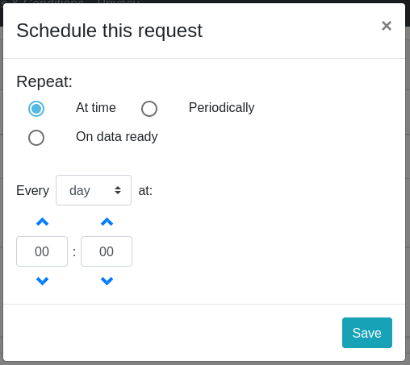
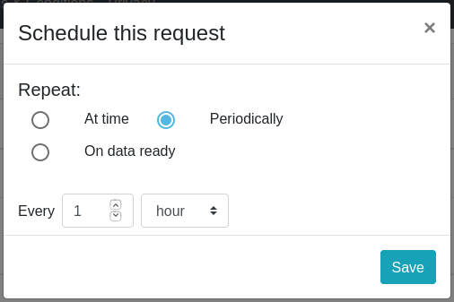
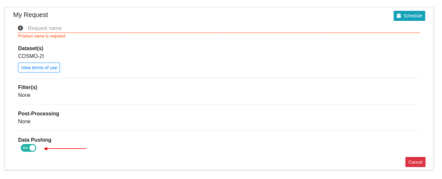

# **MISTRAL Documentation**

**Author**: CINECA, Dedagroup

**Date**: 15 February 2021

**Status**: draft

---

**Table of contents**

[TOC]

---

# **Web Frontend features**

## **Data**

### **Download open data**

For all users, even those not logged in, it is possible to download packages of open data. The packages are produced on a daily basis. The user must click on the icon marked by the red arrow in the following image:


A dialog window will open with the list of downloadable packages:


Currently this feature is available for the following datasets:

- Multimodel ensemble forecast by Arpa Piemonte
- Surface Rainfall Intensity from Radar-DPC
- Italy Flash Flood

The observations data is open, too. The user can download them in the map of observations.

### **Data Extraction**

The user can obtain data from one or more datasets of the platform through the Web Frontend feature of the Data Extraction.

In the first step, the user must select one or more datasets (multiple selection is allowed only with datasets of the same category: observation, forecast, radar).

In the second step, the user can filter respect the provided parameters that are specific for the dataset category:

| Category    | Filter                                                         |
| ----------- | :------------------------------------------------------------- |
| Observation | Reftime, Level, Product, Timerange                             |
| Forecast    | Reftime, Area, Level, Origin, Proddef, Product, Run, Timerange |
| Radar       | Reftime, Area, Level, Origin, Proddef, Product, Run, Timerange |

In the third step, the user can apply a set of post-processing that is specific for the dataset category:

| Category    | Post-processing                                                                    |
| :---------- | :--------------------------------------------------------------------------------- |
| Observation | Derived Variables, Time Post Processing, Quality Control Filter, Format Conversion |
| Forecast    | Derived Variables, Time Post Processing, Space Post Process                        |
| Radar       | Derived Variables, Time Post Processing, Space Post Process                        |

In the fourth and last step, the user must enter a name for the current request and submit the request to the system.

Before submitting the request, the user can schedule the request by clicking on the "Schedule" button and can redirect the result of the request to an AMQP queue through the switch “Data Pushing”.

In each step of the data extraction, it is possible to interrupt the creation of the current request by clicking on the Cancel button.
The user is brought back to the dataset selection page.


### **My Requests**

After submitting a request, the user is led to the "My Requests" page:


There is a list of all requests submitted by the user. The first request on the list is the one just submitted: the status is _PENDING_ because the execution of the request is still in progress.

By clicking on the icon:


the information on the page is updated. When the status of the request becomes _SUCCESS_, it means that the execution has finished successfully.

The user can download the output data of the request by clicking the icon:


The user can expand the request box information by clicking the icon:


Clicking the trash bin icon the user can choose to delete or archive the request. If the archive option is chosen, only the associated output file is deleted (extraction data) while the request and its details will still be available in the Archive tab. Once the request is archived, it will obviously no longer be possible to download the related file.

The situation of the user disk quota occupation is shown on the widget "Storage" on the left.

The number of requests the user has done in the last hour is shown on the widget "Request Hourly Report" on the left.

By clicking on the Schedules tab, the page will show the list of the scheduled requests of the user.

### **Scheduled queries**

The submission of any request of data extraction can be scheduled. This functionality is not available for all users as it has to be enabled specifically for each account by the Administrator (see [Admin Guide](README.md#admin-guide))

To choose the scheduling options the user has to click on the icon on the "Submit my request" page.


The scheduling options are:

- _At time_ repeats the submission every day at a defined time, every defined day of the week or every defined day of a month.

  

- _Periodically_ repeats the submission with a defined interval in hour, days or minutes. The shortest interval available is 15 minutes.

  

- _On data ready_ option is available only for some datasets. The request is submitted every time new data are available for the selected dataset.

### **Clone as a new request**

In the "My Requests" page, there is the possibility to modify a request and submit it again. If the user expands the box of the request he wants to clone, he can see some icons on the upper right side of the box. The first icon is the one to click to start cloning the request:


By clicking on the icon, the user ends up with the same pre-filled request and has the possibility to modify the filter and post-processing settings and to re-submit the modified query as if it were a new request.

### **Data pushing**

First of all, the account must be enabled to the "Data pushing" feature. The user has to contact the Administrator to be enabled. The Administrator will enable the user to "Data pushing" and will create an AMQP queue for the user.

Once enabled, in the "Submit my request" page the user will see the "Data pushing" option



Enabling the "Data pushing" option the user will receive in his AMQP queue a notification when its data extraction has been completed.
The message will contain:

- the name of the submitted request
- the queried reftime
- the request status stating if the data extraction has been successful or not
- the error messages (in case of failure of the data extraction)
- the name of the output file and the url to download it (in case of success of the data extraction)

---

## **Visualisation**

The MISTRAL web Frontend provides some tools for the visualization of observed and forecast data. They are available under the menu "Maps" and they are described in the following paragraphs.

### **Forecasts map**

Forecasts data from COSMO-5M and COSMO-2I models are displayed in this web visualisation tool. The meteorological fields are represented with raster map images in PNG format. These images are not geo-referenced and is not possible to change dynamically zoom during the visualization.


A sort of temporal animation was implemented showing the images in sequence (carousel).

It is possible to visualise only the data of the last two runs of the models: 00 and 12.

### **Italy Flash Flood map**

The same web visualisation tool, with raster map images in PNG format, has been used to display the Italy Flash Flood data:


Only visualisation of the last run data is available.

### **Observations map**

Observed data from ground stations are displayed on a customized web viewer developed for Mistral project: the measurements of the weather variables are visualized as geo-referenced markers over an Open Street Map layer.


The user can filter by Variable, Date (the user can select a whole day or identify a time interval of less than 24 hours within that day), Level, Time range, Network, Group of Licenses and Quality Control Filter.

The user can download the data filtered according to the selections set in the filter parameters.

In addition, the viewer provides the meteograms of the data for each variable both at the single station level and at all stations selected at that time by the filter.

The viewer also provides station displays.

### **Multi-layer map**

In the multi-layer visualization the data are represented on web tiled map, like the ones provided by OpenStreetMap. In this way the user is able to navigate and zoom the map and also to over-impose different meterological parameters.

The multi-layer visualisation is available for COSMO-5M, COSMO-2I and Italy Flash Flood data. Furthermore, the visualization of Arpa Piemonte's Multimodel data is available as geo-referenced markers on the map.


---

## **Self-registration**

On the Web Frontend, users are given the opportunity to self-register using the "Sign up" button in the menu.
In this way they obtain the credentials to log into the portal.
The self-registered users can access a set of additional features than the non-registered users.


---

## **Admin guide**

### **User roles**

The functionalities for each _profile_ are outlined in this _[table](https://gitlab.hpc.cineca.it/mistral/meteo-hub/-/issues/172#note_5812)_.

The functionality enabling and the configurations for the other user profiles have been implemented **at the user level**.

So, the profiles "Amministratore", "Pagante", "Institutional", "Demo" and "Auto-registrato" have to be configured by the administrator at the time of the creation of the account, through the Frontend user creation feature.

The _role_ field is only used to remind the administrator the type of the user, but from a functional point of view it is irrelevant.

At the moment, the roles implemented are:

- _Administrators_
- _Institutional_
- _User_

The _Self-registered_ users are configured with profile _User_.

Other roles can be added when needed.

### **User configuration**

_Email_: it should be the real email address of the user in fact the password could be notified by email. It constitutes also the _userid_.

_Roles_: the role field is only used to remind the administrator the type of the user, but from a functional point of view it is irrelevant.

_Group_: there is currently a single group to which all users belong. The group has no function at the moment.

_Account expiration_: the user can be assigned an expiration date.

_Disk quota_: each user has assigned a disk quota in which the results of his requests are saved. This quota also constitutes the ceiling for the space available to the user.

_AMQP queue_: the name of the AMQP queue on which the user is enabled to do data pushing must be indicated here. Not all users are enabled for this functionality.

_Requests expirations_ (in days, 0 to disable): the value of the field indicates the number of days after which the request results are automatically deleted from the user's disk quota. If set to 0 then these are not deleted. The value of this field can also be modified by the user himself.

_Delete expired requests_ : allow the user to choose if the expired request will be deleted or archived. If set to _NO_ (default option) the expired request will be archived.

_Enable access to Open Datasets_: by selecting this check the user is enabled to access the Open datasets.

_Allowed additional datasets_: the user can be enabled to access to single datasets.

Some functionalities are available only prior authorization. The administrator can provide user access to them at the time of creating the account or modifying it later.
These functionalities are:

- Possibility to schedule a data extraction, enabled in user's profile page selecting the checkbox _Schedule_
- Use of post-processing tools, enabled in user's profile page selecting the checkbox _Postprocessing_ `*`
- Access to archived observed data, enabled in user's profile page selecting the checkbox _Observed Archive_

Additional parameters the administrator can configure at user level are:

- _Max Templates_ : the maximum number of templates of each kind (.shp templates or .grib templates) the user can upload in his personal space. Set 0 to allow unlimited number of uploaded templates.
- _Max output size_ : the maximum file output size for each request of data extraction
- _Requests per hour_: the maximum number of request of data extraction a user can submit each hour. Set 0 to allow unlimited number of requests per hour.

`*` _Format conversion_ and _Quality Control Filtering_ are enabled for all users. They are not subject to the enabling of the Postprocessing field.

### **Packaged data for public access**

The administrator has the possibility to create files of packaged data available for public download.\
In order to create a scheduled data extraction of public package data, _Open data schedule_ option has to be enabled in Schedule panel.
\
The resulting output file will be automatically available in the list of downloadable packages (see [Download open data](README.md#download-open-data))\
The _opendata_ flag is available only for dataset with open license.\
Opendata schedules and opendata request are marked by a specific label in "My Requests" page.

### **How To**

- **How to enable a user to “Data Pushing”**

To enable a user for "Data Pushing", the administrator must connect to the "Rabbit mq" console and create a dedicated AMQP queue for the user. The "AMQP queue" field in user's profile has to be updated with the name of the newly created dedicated AMQP queue.

- **How to give a user access to a dataset**

The authorization to access a dataset is implemented at the user level: it is the administrator who enables each account to access certain datasets, at the time of creating the account or modifying it later.

The abilitation is managed in two ways:

1. enabling access to all open datasets selecting _Enable access to Open Datasets_ checkbox

2. enabling additional datasets one by one

- **How to add a new dataset**

A dataset consists of:

- an Arkimet directory containing the Arkimet archive and the dataset configuration.
- a database record where all dataset properties are saved

In order to create a new dataset, a new Arkimet directory has to be created with the following path: _data/arkimet/dataset_folder_. See [Arkimet config chapter](README.md#arkimet-config-files) for more information on how create a dataset configuration file.\
A new dataset entry has to be created in the database. The element properties are the same described for the dataset configuration.Every dataset must have an attribution reference and a license reference chosen from the attribution and license elements previously saved in the database.\
If the chosen license is an open one, the dataset will be automatically available for data extraction to all registered users. In case of datasets of observed data with an open license, data will be automatically visible on the observations map and available for download by map. If its license is a proprietary one, dataset will be visible in the dataset list page but available for data extraction only to users authorized by the administator.

To manage datasets, licenses and attribute entries in the database, Administrators can use also the dedicated interfaces.


---

## **User guide**

### **User profile**

By clicking on the Profile icon in the menu, users can access the Profile page. In the Profile page all the parameters that characterize the user profile can be viewed:

_Name_: it is the name of the user.

_Email_: it is the real email address of the user and also _userid_.

_Group_: the group has no function at the moment.

_Roles_: it is a classification of users.

_Privacy accepted_: if the user accepted the Privacy policy of the portal.

_Observation archive allowed_: if YES than the user is enabled to access the archived observed data.

_Postprocessing allowed_: if YES than the user is enabled to use post-processing tools.

_Schedules allowed_: if YES than the user is enabled to schedule the data extractions.

_AMQP Queue_: the name of the AMQP queue on which the user is enabled to do data pushing is indicated here. Not all users are enabled for this functionality.

_Allowed datasets_: the user can be enabled to access single datasets.

_Account expiration_: only if the user has an expiration date.

_Disk quota_: each user has assigned a disk quota in which the results of his requests are saved. This quota also constitutes the ceiling for the space available to the user.

_Max allowed output size_ : the maximum file output size for each request of data extraction

_Max number of templates_ : the maximum number of templates of each kind (.shp templates or .grib templates) the user can upload in his personal space. Set 0 to allow unlimited number of uploaded templates.

_Open datasets allowed_: by selecting this check the user is enabled to access the Open datasets.

_Allowed requests per hour_: the maximum number of request of data extraction a user can submit each hour. Set 0 to allow unlimited number of requests per hour.

_Requests expiration_ (in days, 0 to disable): the value of the field indicates the number of days after which the request results are automatically deleted from the user's disk quota. If set to 0 then these are not deleted. The value of this field can also be modified by the user himself.

_Delete expired requests_ : allow the user to choose if the expired request will be deleted or archived. If set to _NO_ (default option) the expired request will be archived.

_Last password change_: the date of the last change of the password.

The image below shows the Profile page:


In the Profile page, the user is able to:

- change password
- to customize the following item (by clicking on the EDIT function icon):
  - Name
  - Surname
  - Requests expirations (in days, 0 to disable): the user can select how many days he needs to keep the results of his requests available on My Request page before they are automatically deleted.
  - Delete expired requests (Default _No_): the user can decide if the expired requests will be deleted or archived


### **How to build a Data Extraction and Post-processing request**

Two video tutorials explain the main functions offered by Meteo-hub and are available on the MISTRAL YouTube channel.

The first video tutorial illustrates:

- Home page of the Mistral project website
- The basic functionalities present in Meteo-hub platform _version 0.2_ through the four steps provided in Meteo-hub:

  - Submit your Data Extraction
  - Filter your data: how to select filter for customizing the request
  - Choose a Post-processing: derived variables
  - Submit My Request: immediately or scheduled

- Presentation of the My request page: List of submitted request, Download or Delete a request, List of scheduled request.

It is available on MISTRAL project YouTube channel:

https://www.youtube.com/watch?v=v6JuqW2tPag

The second video tutorial illustrates:

- Open Services page on Mistral project website
- The new features developed and present in Meteo-hub _version 0.3_ illustrated through the four steps of construction and submission of the request:

  - Submit your Data Extraction
  - Filter your data: interactive selection where the other filters adjust according to the user's selection
  - Choose a Post-processing: Derived variables, Space post-processing, Time post-processing
  - Submit My Request

- My request page: Copy the request to clipboard, Download the JSON file of the request.

It is available on MISTRAL project YouTube channel:

https://www.youtube.com/watch?v=bAQD-IjS8oQ&t

### **How to download all the observed data with a scheduled request**

Scheduled requests can be used to automatically extract all the data of a selected dataset as they are ingested on MeteoHub platform.

To daily download all the data of a specified observed dataset, a user has to:

- create a request selecting that dataset
- select as _Reftime_ the day before from 00:00 to 23:59
- add the desired filters. If no filters are set, all the available data in the selected dataset for the selected time interval will be extracted
- enable the _Quality Control Filter_ if he wants to extract only quality checked data
- in the "Submit your request" step, schedule the request as: _Repeat at time_, _Every day at_ and choose the time he prefers

**Please note:**\
Using the scheduled data extractions users will not have an exact replica of the dataset,
because all data ingested on the platform later than a day are lost. This is, for example, the case of data that are re-send days before to overwrite and correct older data.\
The only way to exactly replicate the dataset, at the moment, is using the Pushing via an AMQP queue.

---

# **Licenses management**

Every dataset is linked to:

- a single license
- a single attribution
- in case of dataset of observations data, one or more networks

All these parameters are defined in both the dataset configuration file and the record in the application database related to the dataset (except for the networks.They are defined only in the configuration file).

Every license is linked to a Group of licenses. The groups of licenses define and collect licenses compatible with each other. Examples can be _CCBY_COMPLIANT_ Group of licenses or _CCBY-SA_COMPLIANT_ Group of licenses.\
This because some licenses, despite being open licenses, belong to different compatible groups. Data coming from datasets with licenses from different compatible groups cannot be mixed in the same output of a data extraction or mixed when visualized on a map.\
In practice, a user cannot continue with the following data extraction steps if datasets coming from different license groups have been selected in the first one. Besides, for the observations map the filtering field _"Group of licenses"_ is mandatory.

For a better optimization in extracting data for maps visualization, it is recommended to use different Dballe DSN corresponding to the different groups of licenses. For every group of licenses saved in the database it is possible to indicate the name of the corresponding Dballe DSN in _dballe_dsn_ field.

For reasons related to Arkimet and Dballe software architecture it is also recommended to use different Dballe DSN for data coming from mobile stations and from fixed station even if under the same group of licenses.\
Conventionally the Dballe DSN for data coming from mobile station will have the same name of the DSN for fixed station corresponding to the same group of licenses with the \__MOBILE_ suffix.\
**Example**\
There is a dataset of observations data with license _CCBY 4.0_ from the _CCBY_COMPLIANT_ license group with data both coming from mobile stations and fixed stations. The _CCBY_COMPLIANT_ license group is associated to a Dballe DSN named _DBALLECCBY_. Data from fixed station will be ingested in a Dballe instance called _DBALLECCBY_ while data from mobile stations will be ingested in a Dballe instance called _DBALLECCBY_MOBILE_.\
When a user requests data from this dataset, the system automatically extracts the data from both databases and joins them in a single output file or a single map.

---

# **API**

The API are documented using the swagger definition at this [URL](https://meteohub.mistralportal.it:7777).

# **Installation guide**

## **Data portal**

### **Meteo Hub v0.4.5**

MeteoHub is a docker-based environment with many components orchestrated through the docker-compose utility framework. MeteoHub is implemented as an extension of the open source framework RAPyDo that implements core functionalities for most of the adopted services (Backend APIs, Frontend UI, Celery, RabbitMQ, Redis) and wraps the use of docker-compose.
To deploy MeteoHub a number of prerequisites are needed, in particular docker >= 17.05, python >= 3.6, git and the rapydo controller (usually installed with pip). Docker-compose is also required, but automatically installed with the controller.

The MeteoHub repository can be cloned from the Cineca Gitlab:

`$ git clone https://gitlab.hpc.cineca.it/mistral/meteo-hub.git`

Once installed docker, python and pip; the controller can ben installed as:

`$ sudo pip3 install rapydo`

to install the latest released version, or:

`$ sudo pip3 install git+https://github.com/rapydo/do.git@2.2`

to install a specific version

Once installed any controller version, version incompatibilities can be detect by using the `rapydo version` command:

for example:

```
$ rapydo --version
rapydo version: 2.1

$ git branch --show-current
0.4.5

$ rapydo version

rapydo: 2.2	mistral: 0.4.5	required rapydo: 2.2

This project is not compatible with rapydo version 2.1
Please upgrade rapydo to version 2.2 or modify this project

rapydo install 2.2

```

#### **Development deployment**

The following commands are required to configure and execute the stack in development mode:

To initialize the configuration:
`$ rapydo init`

This command will also create a .projectrc file with default settings

To pull the docker images required to the stack:

`$ rapydo pull`

To build the custom MeteoHub image:

`$ rapydo build`

To start the stack:

`$ rapydo start`

All services will automatically start, except for the REST APIs service that is required to be manually executed with:

`$ rapydo shell backend --default`

In another shell the container status and logs can be inspected by using docker commands or corresponding rapydo commands:

`$ docker logs mistral_frontend_1`
`$ rapydo logs frontend`

When the frontend compilation is completed the web interface will be available on localhost:80
APIs will respond on localhost:8080

#### **Production deployment**

To run the application in production mode an hostname should be assigned to the host, to properly create a valid SSL certificate (although the IP address can be used, in this case a self-signed certificate will be created)

The following commands are required to configure and execute the stack in production mode:

To initialize the configuration:

`$ rapydo --prod --hostname my.host.name init`

This command will also create a `.projectrc` file with default settings including enabled production mode, provided hostname and random passwords for all the services. Feel free to change the random passwords with any other password you prefer (passwords will be injected on the services at the first run) by editing the `.projectrc` file

To pull the docker images required to the stack:

`$ rapydo pull`

To build the custom MeteoHub image:

`$ rapydo build`

To start the stack:

`$ rapydo start`

All services will automatically start, including an nginx reverse proxy. An ssl certificate will be automatically create by using Let's Encrypt.

The container status and logs can be inspected by using docker commands or corresponding rapydo commands:

```
$ docker logs mistral_frontend_1

or:

$ rapydo logs frontend
```

The web interface will be available on https://my.host.name
and APIs will respond on https://my.host.name/api

SSL certificates created with Let's Encrypt expire in 3 months and ca be renewed by using the command:

`$ rapydo ssl`

A crontab to automatize the certificate renewal should be considerd:

For example to renew every Monday at 00:00 AM

`0 0 * * 1 cd /your/project/path && /usr/local/bin/rapydo ssl > /your/project/path/data/logs/ssl.log 2>&1`

---

#### **Arkimet config files**

The list of the config fields managed by Arkimet can be found [here](https://github.com/ARPA-SIMC/arkimet/issues/67#issuecomment-293193990).

The fields "filter, index, unique, remote import, step, replace, type, format, path" are the standard Arkimet ones, necessary for ingestion of data in Arkimet datasets.

The field "name" in the config file is not considered by Arkimet.

For Arkimet, the dataset name is the same as the corresponding directory name and is more like an ID than a name.

The field "description" is optional and is managed by Arkimet. The content of this field is displayed with the dataset name in the dataset list page on the Frontend.

Arkimet allows you to add custom fields whose name starts with '\_' and which are returned in the summary.

**In Meteo-hub we have added the following fields that are used to operate the Frontend:**

- _\_name_

In this field you can enter the name of the dataset you want to appear to end users. The Frontend first looks for this field, if it is not present then use Arkimet's field "name".

Optional field.

- _\_category_

The code indicating the type of dataset must be entered in this field.

Mandatory field.

The codes are:

```
FOR forecast
OBS osservati
RAD radar
```

- _\_license_

The name of the license applied to the dataset must be entered in this field.

The license name must be one of those present in the name field of the LICENSE table of the database.

Mandatory field.

- _\_attribution_

The name of the attribution applied to the dataset must be entered in this field.

The name must be one of those present in the name field of the database ATTRIBUTION table.

Mandatory field.

#### **Dballe DSN**

DSN in Dballe are used to subdivide data coming from mobile station and from fixed station and networks with licenses belonging to different license groups.\
The first step in adding a Dballe DSN is to create a new database with the following commands:

enter in postgres container\
`$ rapydo shell postgres`

create a new database

```
$ psql -v ON_ERROR_STOP=1 --username "$POSTGRES_USER" << EOSQL
$ CREATE DATABASE "new_database_name";
$ EOSQL
```

add the newly created database to _/var/lib/postgresql/current/pg_hba.conf_

```
hostnossl       new_database_name  user_name 0.0.0.0/0    password
```

exit the container and restart the service with the following command:

`$ rapydo start postgres`

Once the new database has been created it has to be initialized as a Dballe instance:
enter in backend container
`$ rapydo shell backend`

inizialized the new database:

```
$ dbadb wipe --dsn=postgresql://${ALCHEMY_USER}:${ALCHEMY_PASSWORD}@${ALCHEMY_HOST}:${ALCHEMY_PORT}/new_database_name
```

As explained in [License Management chapter](README.md#licenses-management) in order to enable data extraction from the newly created Dballe DSN, it has to be associated in the application database to a group of licenses.\
This operation is not requested in case of DSN for data coming from mobile station: if the new DSN follows the naming convention previously illustrated in the above-mentioned chapter, it will be automatically enable for data extraction if the corresponding DSN for data from fixed station has been previously associated to the corresponding group of licenses.

---

### **NiFi-based ingestion component**

The ingestor machine uses docker and is equipped with the following containers:

| Container ID | Image               | Ports                                          | Name          | Description                                                                          |
| ------------ | ------------------- | ---------------------------------------------- | ------------- | ------------------------------------------------------------------------------------ |
| b409f251c311 | arpaesimc/centos    |                                                | arpaesimcnifi | Main container, including: DBAlle and Arkimet libraries, Apache NiFi, Python scripts |
| 0f05ef726844 | postgres            | 0.0.0.0:5432->5432/tcp                         | nice-pg       | Operational PostGres DB for NiFi                                                     |
| b4e7ab3ef91f | dpage/pgadmin4      | 80/tcp, 443/tcp, 0.0.0.0:5050->5050/tcp        | pgadmin4      | PostGres DB client (optional, just for management tasks)                             |
| d2c4cd796a59 | portainer/portainer | 0.0.0.0:8000->8000/tcp, 0.0.0.0:9000->9000/tcp | portainer     | Docker client (optional, just for management tasks)                                  |

Container _arpaesimcnifi_ has been set-up with the following steps:

1. Deploy from original releases available from [https://github.com/ARPA-SIMC/dballe](https://github.com/ARPA-SIMC/dballe)

   `docker run -it arpaesimc/fedora:31 /bin/bash`

   `docker run -it arpaesimc/centos:8 /bin/bash`

2. Update the libraries available from `@copr:copr.fedorainfracloud.org:simc:stable` to the latest version available

3. Install NiFi 1.11.4 as documented here:

   https://nifi.apache.org/docs/nifi-docs/html/getting-started.html

   https://nifi.apache.org/docs/nifi-docs/html/administration-guide.html

   Installation folder: /home/nifi/nifi-1.11.4

   Operational folder: /opt/nifi

4. Create working directories:

   /home/nifi/ingest/radar
   /home/nifi/ingest/obs
   /opt/nifi/nifi_ok_flowfile
   /opt/nifi/nifi_error_flowfile
   /opt/nifi/temp

5. Copy provided python scripts into folder:
   /home/nifi/ingest/obs

6. Mount Arkimet storage folder to:
   /opt/arkimet_data

7. Create table structure in NiFi’s operational DB by launching the provided SQL script

8. Load the provided NiFi’s XML templates into the application.
   Create context parameters copying them from the TXT list provided.
   Start NiFi flows.

---

## **Open Data Catalogue**

### **Installing CKAN with docker compose**

The stack is based on Docker containers deployed with docker-compose, as described in the following documentation:

[https](https://docs.ckan.org/en/2.8/maintaining/installing/install-from-docker-compose.html)[://](https://docs.ckan.org/en/2.8/maintaining/installing/install-from-docker-compose.html)[docs](https://docs.ckan.org/en/2.8/maintaining/installing/install-from-docker-compose.html)[.](https://docs.ckan.org/en/2.8/maintaining/installing/install-from-docker-compose.html)[ckan](https://docs.ckan.org/en/2.8/maintaining/installing/install-from-docker-compose.html)[.](https://docs.ckan.org/en/2.8/maintaining/installing/install-from-docker-compose.html)[org](https://docs.ckan.org/en/2.8/maintaining/installing/install-from-docker-compose.html)[/](https://docs.ckan.org/en/2.8/maintaining/installing/install-from-docker-compose.html)[en](https://docs.ckan.org/en/2.8/maintaining/installing/install-from-docker-compose.html)[/2.8/](https://docs.ckan.org/en/2.8/maintaining/installing/install-from-docker-compose.html)[maintaining](https://docs.ckan.org/en/2.8/maintaining/installing/install-from-docker-compose.html)[/](https://docs.ckan.org/en/2.8/maintaining/installing/install-from-docker-compose.html)[installing](https://docs.ckan.org/en/2.8/maintaining/installing/install-from-docker-compose.html)[/](https://docs.ckan.org/en/2.8/maintaining/installing/install-from-docker-compose.html)[install](https://docs.ckan.org/en/2.8/maintaining/installing/install-from-docker-compose.html)[-](https://docs.ckan.org/en/2.8/maintaining/installing/install-from-docker-compose.html)[from](https://docs.ckan.org/en/2.8/maintaining/installing/install-from-docker-compose.html)[-](https://docs.ckan.org/en/2.8/maintaining/installing/install-from-docker-compose.html)[docker](https://docs.ckan.org/en/2.8/maintaining/installing/install-from-docker-compose.html)[-](https://docs.ckan.org/en/2.8/maintaining/installing/install-from-docker-compose.html)[compose](https://docs.ckan.org/en/2.8/maintaining/installing/install-from-docker-compose.html)[.](https://docs.ckan.org/en/2.8/maintaining/installing/install-from-docker-compose.html)[html](https://docs.ckan.org/en/2.8/maintaining/installing/install-from-docker-compose.html)

The following tools are required:

- **Docker Engine**: the containerization runtime

- **Docker Compose**: multi-container orchestration tool

The following container have been created:

| **Service Name**            | **image**                                          | **Network**           | **Volumes**                                                                         | **notes**                                                                                                                                                                                                                                                                                                                                                                                                                                                                                                                                                                                                                                                                                                                                                                                                                                                                                                                                                                                                                                                                                                                                                                                                                                                                                                                                                                                                                                                                                                                                                                                                                                                                                                                                                                                                                                                                                                                                                                                                                                                                                                                                                                                                                                                                                                                                                                                                                                                                                                                                                                             |
| :-------------------------- | :------------------------------------------------- | :-------------------- | :---------------------------------------------------------------------------------- | :------------------------------------------------------------------------------------------------------------------------------------------------------------------------------------------------------------------------------------------------------------------------------------------------------------------------------------------------------------------------------------------------------------------------------------------------------------------------------------------------------------------------------------------------------------------------------------------------------------------------------------------------------------------------------------------------------------------------------------------------------------------------------------------------------------------------------------------------------------------------------------------------------------------------------------------------------------------------------------------------------------------------------------------------------------------------------------------------------------------------------------------------------------------------------------------------------------------------------------------------------------------------------------------------------------------------------------------------------------------------------------------------------------------------------------------------------------------------------------------------------------------------------------------------------------------------------------------------------------------------------------------------------------------------------------------------------------------------------------------------------------------------------------------------------------------------------------------------------------------------------------------------------------------------------------------------------------------------------------------------------------------------------------------------------------------------------------------------------------------------------------------------------------------------------------------------------------------------------------------------------------------------------------------------------------------------------------------------------------------------------------------------------------------------------------------------------------------------------------------------------------------------------------------------------------------------------------ |
| webserver                   | nginx:alpine                                       | 80:8080<br />443:8443 | webserver_config:/etc/nginx                                                         | Reverse proxy, remaps:<br />/catalog -> ckan:5000<br />/datapusher -> datapusher:8800                                                                                                                                                                                                                                                                                                                                                                                                                                                                                                                                                                                                                                                                                                                                                                                                                                                                                                                                                                                                                                                                                                                                                                                                                                                                                                                                                                                                                                                                                                                                                                                                                                                                                                                                                                                                                                                                                                                                                                                                                                                                                                                                                                                                                                                                                                                                                                                                                                                                                                 |
| ckan                        | Built from source. v2.8.2                          | Internally on :5000   | ckan_config: /etc/ckan<br />ckan_home:/usr/lib/ckan<br />ckan_storage:/var/lib/ckan | [https](https://github.com/ckan/ckan/tree/ckan-2.8.2)[://](https://github.com/ckan/ckan/tree/ckan-2.8.2)[github](https://github.com/ckan/ckan/tree/ckan-2.8.2)[.](https://github.com/ckan/ckan/tree/ckan-2.8.2)[com](https://github.com/ckan/ckan/tree/ckan-2.8.2)[/](https://github.com/ckan/ckan/tree/ckan-2.8.2)[ckan](https://github.com/ckan/ckan/tree/ckan-2.8.2)[/](https://github.com/ckan/ckan/tree/ckan-2.8.2)[ckan](https://github.com/ckan/ckan/tree/ckan-2.8.2)[/](https://github.com/ckan/ckan/tree/ckan-2.8.2)[tree](https://github.com/ckan/ckan/tree/ckan-2.8.2)[/](https://github.com/ckan/ckan/tree/ckan-2.8.2)[ckan](https://github.com/ckan/ckan/tree/ckan-2.8.2)[-2.8.2](https://github.com/ckan/ckan/tree/ckan-2.8.2)                                                                                                                                                                                                                                                                                                                                                                                                                                                                                                                                                                                                                                                                                                                                                                                                                                                                                                                                                                                                                                                                                                                                                                                                                                                                                                                                                                                                                                                                                                                                                                                                                                                                                                                                                                                                                                          |
| db                          | Built from source, starting from _mdillon/postgis_ | Internally on :5432   | pg_data:/var/lib/postgresql/data                                                    | [https](https://hub.docker.com/r/mdillon/postgis)[://](https://hub.docker.com/r/mdillon/postgis)[hub](https://hub.docker.com/r/mdillon/postgis)[.](https://hub.docker.com/r/mdillon/postgis)[docker](https://hub.docker.com/r/mdillon/postgis)[.](https://hub.docker.com/r/mdillon/postgis)[com](https://hub.docker.com/r/mdillon/postgis)[/](https://hub.docker.com/r/mdillon/postgis)[r](https://hub.docker.com/r/mdillon/postgis)[/](https://hub.docker.com/r/mdillon/postgis)[mdillon](https://hub.docker.com/r/mdillon/postgis)[/](https://hub.docker.com/r/mdillon/postgis)[postgis](https://hub.docker.com/r/mdillon/postgis)                                                                                                                                                                                                                                                                                                                                                                                                                                                                                                                                                                                                                                                                                                                                                                                                                                                                                                                                                                                                                                                                                                                                                                                                                                                                                                                                                                                                                                                                                                                                                                                                                                                                                                                                                                                                                                                                                                                                                  |
| <p>solr</p><p> </p><p> </p> | Built from source, starting from _solr:6.6.2_      | Internally on :8983   |                                                                                     | [https](https://hub.docker.com/layers/solr/library/solr/6.6.2/images/sha256-02c52d10a1e0c505b203051c416b0fa16d3f0aed36ed5c71b83b4b492802eae5?context=explore)[://](https://hub.docker.com/layers/solr/library/solr/6.6.2/images/sha256-02c52d10a1e0c505b203051c416b0fa16d3f0aed36ed5c71b83b4b492802eae5?context=explore)[hub](https://hub.docker.com/layers/solr/library/solr/6.6.2/images/sha256-02c52d10a1e0c505b203051c416b0fa16d3f0aed36ed5c71b83b4b492802eae5?context=explore)[.](https://hub.docker.com/layers/solr/library/solr/6.6.2/images/sha256-02c52d10a1e0c505b203051c416b0fa16d3f0aed36ed5c71b83b4b492802eae5?context=explore)[docker](https://hub.docker.com/layers/solr/library/solr/6.6.2/images/sha256-02c52d10a1e0c505b203051c416b0fa16d3f0aed36ed5c71b83b4b492802eae5?context=explore)[.](https://hub.docker.com/layers/solr/library/solr/6.6.2/images/sha256-02c52d10a1e0c505b203051c416b0fa16d3f0aed36ed5c71b83b4b492802eae5?context=explore)[com](https://hub.docker.com/layers/solr/library/solr/6.6.2/images/sha256-02c52d10a1e0c505b203051c416b0fa16d3f0aed36ed5c71b83b4b492802eae5?context=explore)[/](https://hub.docker.com/layers/solr/library/solr/6.6.2/images/sha256-02c52d10a1e0c505b203051c416b0fa16d3f0aed36ed5c71b83b4b492802eae5?context=explore)[layers](https://hub.docker.com/layers/solr/library/solr/6.6.2/images/sha256-02c52d10a1e0c505b203051c416b0fa16d3f0aed36ed5c71b83b4b492802eae5?context=explore)[/](https://hub.docker.com/layers/solr/library/solr/6.6.2/images/sha256-02c52d10a1e0c505b203051c416b0fa16d3f0aed36ed5c71b83b4b492802eae5?context=explore)[solr](https://hub.docker.com/layers/solr/library/solr/6.6.2/images/sha256-02c52d10a1e0c505b203051c416b0fa16d3f0aed36ed5c71b83b4b492802eae5?context=explore)[/](https://hub.docker.com/layers/solr/library/solr/6.6.2/images/sha256-02c52d10a1e0c505b203051c416b0fa16d3f0aed36ed5c71b83b4b492802eae5?context=explore)[library](https://hub.docker.com/layers/solr/library/solr/6.6.2/images/sha256-02c52d10a1e0c505b203051c416b0fa16d3f0aed36ed5c71b83b4b492802eae5?context=explore)[/](https://hub.docker.com/layers/solr/library/solr/6.6.2/images/sha256-02c52d10a1e0c505b203051c416b0fa16d3f0aed36ed5c71b83b4b492802eae5?context=explore)[solr](https://hub.docker.com/layers/solr/library/solr/6.6.2/images/sha256-02c52d10a1e0c505b203051c416b0fa16d3f0aed36ed5c71b83b4b492802eae5?context=explore)[/6.6.2](https://hub.docker.com/layers/solr/library/solr/6.6.2/images/sha256-02c52d10a1e0c505b203051c416b0fa16d3f0aed36ed5c71b83b4b492802eae5?context=explore) |
| redis                       | redis:latest                                       | internally on :6379   |                                                                                     |                                                                                                                                                                                                                                                                                                                                                                                                                                                                                                                                                                                                                                                                                                                                                                                                                                                                                                                                                                                                                                                                                                                                                                                                                                                                                                                                                                                                                                                                                                                                                                                                                                                                                                                                                                                                                                                                                                                                                                                                                                                                                                                                                                                                                                                                                                                                                                                                                                                                                                                                                                                       |

```
CONTAINER ID    	IMAGE                   	COMMAND              	   PORTS            NAMES

9c5a904ea8c8    	docker\_ckan             	"/ckan-entrypoint.sh…"   5000/tcp           ckan

b30ff54f9106    	nginx:alpine            	"nginx -g 'daemon of…"   80/tcp, 0.0.0.0:80->8080/tcp, 0.0.0.0:443->8443/tcp                                                                      webserver

c390866ab566    	redis:latest            	"docker-entrypoint.s…"   6379/tcp          redis

27e4074af172    	clementmouchet/datapusher   "python datapusher/m…"                     datapusher

11eee4e9e787    	docker\_solr             	"docker-entrypoint.s…"   8983/tcp          solr

2d560a0a08ae    	docker\_db               	"docker-entrypoint.s…"   0.0.0.0:5432->5432/tcp                                                                                                        db
```

### **Ckan extensions**

A CKAN extension is a Python package that modifies or extends CKAN. Each extension contains one or more plugins that must be added to your CKAN config file to activate the extension’s features.

The **ckanext-mistral** extension has been created to customize the CKAN template.

The following extensions have been installed:

| **extension**         | **Url**                                              | **version**               | **Plugin attivati**                                                 |
| :-------------------- | :--------------------------------------------------- | :------------------------ | :------------------------------------------------------------------ |
| _Plugin in ckan core_ |                                                      |                           | Stats, Image_view, Text_view, Recline_view                          |
| Datastore             | _Ckan core_                                          |                           | datastore                                                           |
| Datapusher            | https://github.com/ckan/datapusher                   | 2019-01-18                | datapusher                                                          |
| Ckanext-spatial       | https://github.com/ckan/ckanext-spatial              | 2019-03-15                | resource_proxy, spatial_metadata, spatial_query, csw_harvester      |
| Ckanext-dcat          | https://github.com/ckan/ckanext-dcat                 | <p>2019-06-25</p><p> </p> | dcat dcat_json_interface structured_data                            |
| Ckanext-dcatapit      | https://github.com/geosolutions-it/ckanext-dcatapit  | 2019-12-09                | dcatapit_pkg, dcatapit_org, dcatapit_config, dcatapit_csw_harvester |
| Ckanext-mistral       | Mistral extensions                                   | 1.0.0                     | mistral                                                             |
| Ckanext-geoview       | https://github.com/ckan/ckanext-geoview/             | 2019-04-09                | geo_view                                                            |
| Ckanext-harvest       | https://github.com/ckan/ckanext-harvest              | 2019-07-01                | harvest ckan_harvester                                              |
| Ckanext-multilang     | https://github.com/geosolutions-it/ckanext-multilang | 2019-02-01                | multilang                                                           |

### **Web server**

The webserver, running on the nginx:latest image, works as a reverse proxy for the environment.

Two **upstreams** are configured:

**1.** Upstream **ckan** toward ckan:5000

Proxy_pass under location **/catalog** and **/catalog/**

**2.** Upstream **datapusher** toward datapusher:8800

Proxy_pass under location **/datapusher** and **/datapusher/**

### **Ckan configuration**

The following **environment variables** are set by docker-compose and overrides the configuration file’s settings. The variable propagation is described at[ ](https://docs.ckan.org/en/2.8/maintaining/installing/install-from-docker-compose.html#environment-variables)[https](https://docs.ckan.org/en/2.8/maintaining/installing/install-from-docker-compose.html#environment-variables)[://](https://docs.ckan.org/en/2.8/maintaining/installing/install-from-docker-compose.html#environment-variables)[docs](https://docs.ckan.org/en/2.8/maintaining/installing/install-from-docker-compose.html#environment-variables)[.](https://docs.ckan.org/en/2.8/maintaining/installing/install-from-docker-compose.html#environment-variables)[ckan](https://docs.ckan.org/en/2.8/maintaining/installing/install-from-docker-compose.html#environment-variables)[.](https://docs.ckan.org/en/2.8/maintaining/installing/install-from-docker-compose.html#environment-variables)[org](https://docs.ckan.org/en/2.8/maintaining/installing/install-from-docker-compose.html#environment-variables)[/](https://docs.ckan.org/en/2.8/maintaining/installing/install-from-docker-compose.html#environment-variables)[en](https://docs.ckan.org/en/2.8/maintaining/installing/install-from-docker-compose.html#environment-variables)[/2.8/](https://docs.ckan.org/en/2.8/maintaining/installing/install-from-docker-compose.html#environment-variables)[maintaining](https://docs.ckan.org/en/2.8/maintaining/installing/install-from-docker-compose.html#environment-variables)[/](https://docs.ckan.org/en/2.8/maintaining/installing/install-from-docker-compose.html#environment-variables)[installing](https://docs.ckan.org/en/2.8/maintaining/installing/install-from-docker-compose.html#environment-variables)[/](https://docs.ckan.org/en/2.8/maintaining/installing/install-from-docker-compose.html#environment-variables)[install](https://docs.ckan.org/en/2.8/maintaining/installing/install-from-docker-compose.html#environment-variables)[-](https://docs.ckan.org/en/2.8/maintaining/installing/install-from-docker-compose.html#environment-variables)[from](https://docs.ckan.org/en/2.8/maintaining/installing/install-from-docker-compose.html#environment-variables)[-](https://docs.ckan.org/en/2.8/maintaining/installing/install-from-docker-compose.html#environment-variables)[docker](https://docs.ckan.org/en/2.8/maintaining/installing/install-from-docker-compose.html#environment-variables)[-](https://docs.ckan.org/en/2.8/maintaining/installing/install-from-docker-compose.html#environment-variables)[compose](https://docs.ckan.org/en/2.8/maintaining/installing/install-from-docker-compose.html#environment-variables)[.](https://docs.ckan.org/en/2.8/maintaining/installing/install-from-docker-compose.html#environment-variables)[html](https://docs.ckan.org/en/2.8/maintaining/installing/install-from-docker-compose.html#environment-variables)[#](https://docs.ckan.org/en/2.8/maintaining/installing/install-from-docker-compose.html#environment-variables)[environment](https://docs.ckan.org/en/2.8/maintaining/installing/install-from-docker-compose.html#environment-variables)[-](https://docs.ckan.org/en/2.8/maintaining/installing/install-from-docker-compose.html#environment-variables)[variables](https://docs.ckan.org/en/2.8/maintaining/installing/install-from-docker-compose.html#environment-variables)

| **Variable name**         | **Config equivalent**    | **Set value**                                                          |
| :------------------------ | :----------------------- | :--------------------------------------------------------------------- |
| CKAN_SQLALCHEMY_URL       | sqlalchemy.url           | postgresql://ckan:\${POSTGRES_PASSWORD}@db/ckan                        |
| CKAN_DATASTORE_WRITE_URL  | ckan.datastore.write_url | postgresql://ckan:\${POSTGRES_PASSWORD}@db/datastore                   |
| 'CKAN_DATASTORE_READ_URL' | ckan.datastore.read_url  | postgresql://datastore_ro:\${DATASTORE_READONLY_PASSWORD}@db/datastore |
| CKAN_REDIS_URL            | ckan.redis.url           | redis://redis:6379/1                                                   |
| CKAN_SOLR_URL             | solr_url                 | http://solr:8983/solr/ckan                                             |
| CKAN_DATAPUSHER_URL       | ckan.datapusher.url      | http://datapusher:8800                                                 |
| CKAN_SITE_URL             | ckan.site_url            | https://www.mistralportal.it                                           |

The full list of effective environment variable is available at[ ](https://docs.ckan.org/en/2.8/maintaining/configuration.html#environment-variables)[https](https://docs.ckan.org/en/2.8/maintaining/configuration.html#environment-variables)[://](https://docs.ckan.org/en/2.8/maintaining/configuration.html#environment-variables)[docs](https://docs.ckan.org/en/2.8/maintaining/configuration.html#environment-variables)[.](https://docs.ckan.org/en/2.8/maintaining/configuration.html#environment-variables)[ckan](https://docs.ckan.org/en/2.8/maintaining/configuration.html#environment-variables)[.](https://docs.ckan.org/en/2.8/maintaining/configuration.html#environment-variables)[org](https://docs.ckan.org/en/2.8/maintaining/configuration.html#environment-variables)[/](https://docs.ckan.org/en/2.8/maintaining/configuration.html#environment-variables)[en](https://docs.ckan.org/en/2.8/maintaining/configuration.html#environment-variables)[/2.8/](https://docs.ckan.org/en/2.8/maintaining/configuration.html#environment-variables)[maintaining](https://docs.ckan.org/en/2.8/maintaining/configuration.html#environment-variables)[/](https://docs.ckan.org/en/2.8/maintaining/configuration.html#environment-variables)[configuration](https://docs.ckan.org/en/2.8/maintaining/configuration.html#environment-variables)[.](https://docs.ckan.org/en/2.8/maintaining/configuration.html#environment-variables)[html](https://docs.ckan.org/en/2.8/maintaining/configuration.html#environment-variables)[#](https://docs.ckan.org/en/2.8/maintaining/configuration.html#environment-variables)[environment](https://docs.ckan.org/en/2.8/maintaining/configuration.html#environment-variables)[-](https://docs.ckan.org/en/2.8/maintaining/configuration.html#environment-variables)[variables](https://docs.ckan.org/en/2.8/maintaining/configuration.html#environment-variables)

The CKAN configuration file is located at **“/etc/ckan/production.ini**” in the CKAN container. The changes applied to the config setting are:

```
## Site Settings

ckan.site_url = https://mistralportal.it

ckan.root_path = /catalog

## Search Settings

ckan.site_id = default

solr_url = http://solr:8983/solr

## Redis Settings

# URL to your Redis instance, including the database to be used.

ckan.redis.url = redis://redis:6379/0

## CORS Settings

# If cors.origin_allow_all is true, all origins are allowed.

# If false, the cors.origin_whitelist is used.

ckan.cors.origin_allow_all = true

# cors.origin_whitelist is a space separated list of allowed domains.

# ckan.cors.origin_whitelist = http://example1.com http://example2.com

## Plugins Settings

ckan.plugins = stats text_view image_view recline_view datastore datapusher resource_proxy spatial_metadata spatial_query geo_view harvest ckan_harvester mistral dcat dcat_json_interface structured_data dcatapit_pkg dcatapit_org dcatapit_config

` `## Dcatapit Extension settings

ckanext.dcat.rdf.profiles = euro_dcat_ap it_dcat_ap

ckanext.dcat.base_uri = https://www.mistralportal.it/catalog

ckanext.dcatapit.form_tabs = False

## Spatial Extension settings

ckanext.spatial.search_backend = solr-spatial-field

ckan.spatial.srid = 4326

## Front-End Settings

ckan.site_title = CKAN

ckan.site_logo = /images/logo-mistral-bianco-web-300x127.png

ckan.site_description =

## Internationalisation Settings

ckan.locale_default = it

ckan.locale_order = it en

ckan.locales_offered = en it
```

### **Volumes**

| **Name**         | **Mount point(s)**                      |
| :--------------- | :-------------------------------------- |
| webserver_config | Webserver-> webserver_config:/etc/nginx |
| ckan_config      | ckan -> ckan_config:/etc/ckan           |
| ckan_home        | ckan -> ckan_home:/usr/lib/ckan         |
| ckan_storage     | ckan -> ckan_storage:/var/lib/ckan      |
| pg_data          | db -> pg_data:/var/lib/postgresql/data  |

# Mistral Infrastructure

Mistral platform is essentially based on a microservice architecture: the individual components are deployed
independently and operate in a broader design.
The following picture shows an overview of the architecture of the mistral platform and additional services are
briefly described below.


### Open Data Portal

The National Meteorological Open Data Portal is the main access point for citizens, public administrations and private
organizations to meteorological data. The web site provides useful informative sections as well as links to the
underlying services.

### Open Data Catalogue

One of the main goals of the Mistral platform is to improve the interoperability of the datasets and metadata of the
Italian weather sector. For this purpose the Open Data Catalogue allows the direct upload of the managed datasets
to the Italian National Data Open Portal (dati.gov.it) and consequently into EU Open Data Portal (europeandataportal.eu).
This service leverages the CKAN Open Data product and its capabilities that makes data easily discoverable and presentable.

### Ingestor

The core task of the Ingestor is to feed the dataset repository by preserving the integrity of the data, as previously
described [above](#nifi-based-ingestion-component).

### Dataset Repository

The storage is essentially based on two data sources: DB-All.e and Arkimet. The former is a fast on-disk database used
exclusively to store observed data. It allows to manage large amounts of data using its simple API, and provides tools
to import and export in the standard BUFR format. Its main use is to accommodate and make readily available the most
current data while the older ones are periodically archived. The latter plays the role of an actual archive.
Here both forecast and observed data are collected and stored for a long time. It currently supports data in GRIB, BUFR,
HDF5 and VM2 formats. Arkimet manages a set of datasets, each of which contains homogeneous data stored in segments.
It exploits the commonalities between the data in a dataset to implement a fast, powerful and space-efficient indexing
system. When data is ingested into Arkimet, it is scanned and annotated with metadata, such as reference time and
product information, then it is dispatched to one of the datasets configured in the system.
