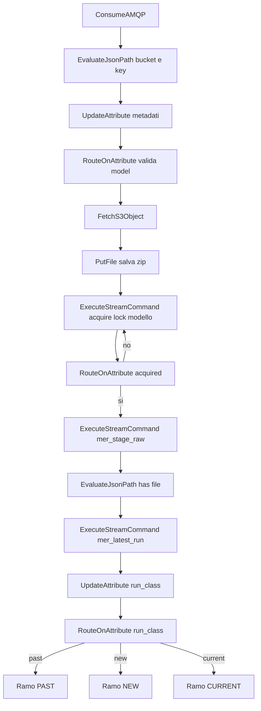
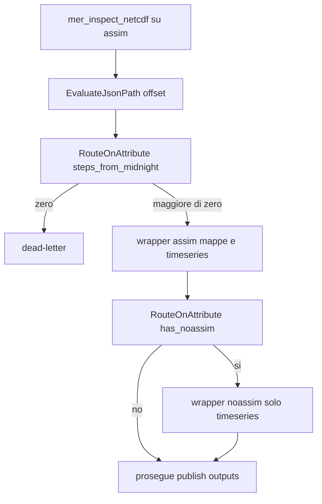

# Guida passo‑passo — Workflow NiFi MER / SHYFEM

Guida per costruire da zero il flusso NiFi che ingesta i pacchetti MER (BOLAM,
ECMWF, ICON) da S3/MinIO, pubblica i dati raw, genera mappe GeoTIFF e timeseries
delle stazioni, e notifica GeoServer.

Un solo Process Group parametrico gestisce tutti e tre i modelli: cambia solo
l'attributo `model`.

---

## 1. Diagramma del flusso (parte comune)



I tre rami finali sono descritti al capitolo 6.

---

## 2. Prerequisiti (una tantum)

### 2.1 Volumi del servizio `nifi` (in `projects/mistral/confs/commons.yml`)

Aggiungi al servizio `nifi`:

```yaml
    volumes:
      # ... mount esistenti ...
      - ${DATA_DIR}/MER/work_dir:/opt/nifi/MER/work_dir
      - ${DATA_DIR}/netcdf_extraction/MER:/opt/nifi/MER/netcdf_extraction
      - ${DATA_DIR}/MER/temp_bkp:/opt/nifi/MER/temp_bkp
```

- `/opt/nifi/MER/netcdf_extraction` deve puntare allo **stesso host** che il
  proxy espone come `/nwp/shyfem` (`${DATA_DIR}/netcdf_extraction/MER`).
- La cartella esposta a frontend `/opt/nifi/nfs/SHYFEM` usa il volume `nfs` che
  è già montato.
- In `/opt/nifi/MER/work_dir/station_list/` deve esserci `station_list_MER.txt`.

### 2.2 Parameter Context `MER`

| Parametro              | Esempio           | Note                  |
| ---------------------- | ----------------- | --------------------- |
| `S3_HOST`            | `minio.dominio` | per Endpoint Override |
| `S3_ACCESS_KEY`      | *(sensitive)*   | credenziale MinIO     |
| `S3_SECRET_KEY`      | *(sensitive)*   | credenziale MinIO     |
| `AMQP_HOST`          | `rabbit`        |                       |
| `AMQP_PORT`          | `5672`          |                       |
| `AMQP_USER`          | *(valore)*      |                       |
| `AMQP_PASSWORD`      | *(sensitive)*   |                       |
| `AMQP_QUEUE`         | `mer.s3.events` | coda concordata       |
| `MER_RESOLUTION`     | `2.5km`         |                       |
| `MER_GEOTIFF_OFFSET` | `0.46`          |                       |

### 2.3 Controller Service S3

`AWSCredentialsProviderControllerService`:

- Access Key ID = `#{S3_ACCESS_KEY}`
- Secret Access Key = `#{S3_SECRET_KEY}`
- Stato: Enabled.

### 2.4 Script

Tutti in `projects/mistral/nifi/scripts/forecasts/MER/`, montati in
`/home/nifi/ingest/forecasts/MER/`. Interprete:

- `bash` per i wrapper `mer_inspect_netcdf_wrapper.sh` e
  `water_level_processor_wrapper.sh`, che impostano l'ambiente conda corretto;
- `python3` di sistema per tutti gli altri.

Impostazioni comuni a ogni `ExecuteStreamCommand`:
`Argument Delimiter = ;`, `Ignore STDIN = true`, `Bulletin Level = WARN`.

---

## 3. Attributi usati nel flusso

| Attributo                                                                                   | Valore / origine                                                  |
| ------------------------------------------------------------------------------------------- | ----------------------------------------------------------------- |
| `s3_bucket`                                                                               | `$.Records[0].s3.bucket.name`                                   |
| `s3_key`                                                                                  | `$.Records[0].s3.object.key`                                    |
| `filename`                                                                                | `${s3_key:substringAfterLast('/')}`                             |
| `model`                                                                                   | `${filename:substringBefore('_')}`                              |
| `run_date`                                                                                | `${filename:substringAfter('_'):substringBefore('.')}`          |
| `nc_stem`                                                                                 | `${model}_${run_date}`                                          |
| `model_dir`                                                                               | `/opt/nifi/MER/work_dir/raw_files/${model}`                     |
| `work_dir`                                                                                | `${model_dir}/${run_date}`                                      |
| `archive_filename`                                                                        | `${model}_${run_date}_${now():format("yyyyMMdd'T'HHmmss")}.zip` |
| `archive_path`                                                                            | `${work_dir}/${archive_filename}`                               |
| `staging_dir`                                                                             | `${work_dir}/staging`                                           |
| `raw_dest`                                                                                | `/opt/nifi/MER/netcdf_extraction/${run_date}/${model}`          |
| `raw_bkp`                                                                                 | `/opt/nifi/MER/temp_bkp/netcdf_extraction/${run_date}/${model}` |
| `exposed_dir`                                                                             | `/opt/nifi/nfs/SHYFEM/${model}`                                 |
| `out_bkp`                                                                                 | `/opt/nifi/MER/temp_bkp/nfs/${run_date}/${model}`               |
| `station_list`                                                                            | `/opt/nifi/MER/work_dir/station_list/station_list_MER.txt`      |
| `geoserver_ready`                                                                         | `${exposed_dir}/${run_date}.geoserver.READY`                    |
| `has_assim` `has_noassim` `has_msl`                                                   | da`mer_stage_raw.py`                                            |
| `assim_path` `noassim_path` `msl_path`                                                | da`mer_stage_raw.py`                                            |
| `map_offset_hours` `timeseries_offset_hours` `max_time_steps` `steps_from_midnight` | da`mer_inspect_netcdf.py`                                       |
| `latest_run`                                                                              | da`mer_latest_run.py`                                           |
| `run_class`                                                                               | calcolato (capitolo 5)                                            |

---

## 4. Costruzione passo‑passo (parte comune)

### Passo 1 — `ConsumeAMQP`

- Tipo: `org.apache.nifi.amqp.processors.ConsumeAMQP`.
- Host Name `#{AMQP_HOST}`, Port `#{AMQP_PORT}`, Virtual Host `/`, User Name
  `#{AMQP_USER}`, Password `#{AMQP_PASSWORD}`, Queue `#{AMQP_QUEUE}`,
  Auto Acknowledge `false`.
- `success` → Passo 2.

### Passo 2 — `EvaluateJsonPath` (bucket e key)

- Destination `flowfile-attribute`.
- `s3_bucket` = `$.Records[0].s3.bucket.name`
- `s3_key` = `$.Records[0].s3.object.key`
- `matched` → Passo 3; `unmatched` e `failure` → dead-letter.

### Passo 3 — `UpdateAttribute` (metadati)

Imposta tutti gli attributi della tabella al capitolo 3 (da `filename` a
`geoserver_ready`). `success` → Passo 4.

### Passo 4 — `RouteOnAttribute` (valida model)

- Proprietà `valid` = `${model:in('BOLAM','ECMWF','ICON')}`.
- `valid` → Passo 5; `unmatched` → dead-letter.

### Passo 5 — `FetchS3Object`

- Bucket `${s3_bucket}`, Object Key `${s3_key}`.
- Region `us-east-1` (placeholder), Endpoint Override URL `https://#{S3_HOST}`,
  Use Path Style Access `true`, credenziali dal Controller Service.
- `success` → Passo 6; `failure` → Retry (3 tentativi, backoff) poi dead-letter.

### Passo 6 — `PutFile` (salva lo zip)

- Directory `${work_dir}`, Create Missing Directories `true`,
  Conflict Resolution `replace`.
- Prima imposta il nome del file via `filename = ${archive_filename}` (in un
  `UpdateAttribute` o nella property Filename del PutFile).
- `success` → Passo 7.

### Passo 7 — Acquire lock modello + attesa (penalty‑loop)

- `ExecuteStreamCommand`: `Command Path = python3`,
  `Command Arguments = /home/nifi/ingest/forecasts/MER/mer_lock.py;acquire;${model_dir};${model}`.
- Instrada la relazione `output stream` verso `EvaluateJsonPath`: il JSON
  stampato da `mer_lock.py` finisce nel contenuto del nuovo FlowFile, mentre
  gli attributi gia' presenti (`model`, `run_date`, `work_dir`, ...) vengono
  copiati automaticamente anche sul nuovo FlowFile. La relazione `original`
  puo' essere auto-terminata.
- `EvaluateJsonPath`: `acquired` = `$.acquired`.
- `RouteOnAttribute`: `wait` = `${acquired:equals('false')}`.
  - `wait` → connessione che **rientra nel processore acquire**; imposta sul
    processore acquire `Penalty Duration = 30 sec` (retry non bloccante).
  - `unmatched` (acquired true) → Passo 8.
- `nonzero status` → dead-letter.

### Passo 8 — `mer_stage_raw.py`

- `python3;/home/nifi/ingest/forecasts/MER/mer_stage_raw.py;${archive_path};${work_dir};${nc_stem}`.
- `output stream` → Passo 9: contiene il JSON con `has_assim`, `assim_path`,
  ecc., e mantiene anche tutti gli attributi costruiti nei passi precedenti.
  `original` → auto-terminate;
  `nonzero status` → dead-letter (include l'hard error 31: nessun NetCDF).

### Passo 9 — `EvaluateJsonPath` (stato file)

- `has_assim` = `$.has_assim`, `has_noassim` = `$.has_noassim`,
  `has_msl` = `$.has_msl`, `assim_path` = `$.assim_path`,
  `noassim_path` = `$.noassim_path`, `msl_path` = `$.msl_path`.
- `matched` → Passo 10.

### Passo 10 — `mer_latest_run.py`

- `python3;/home/nifi/ingest/forecasts/MER/mer_latest_run.py;${exposed_dir}`.
- Instrada `output stream` verso `EvaluateJsonPath` per leggere il JSON
  `{"latest_run": ...}`; anche qui gli attributi esistenti restano sul
  FlowFile risultante.
- `EvaluateJsonPath`: `latest_run` = `$.latest_run`.
- → Passo 11.

### Passo 11 — `UpdateAttribute` (run_class)

Usa la modalità Advanced (clicca con il destro e metti advanced) con queste regole (in ordine):

- se `${latest_run:isEmpty()}` → `run_class = new`
- se `${run_date:gt(${latest_run})}` → `run_class = new`
- se `${run_date:equals(${latest_run})}` → `run_class = current`
- altrimenti → `run_class = past` (questa è la proprietà che va messa di base nel processor, non nelle advanced)

`success` → Passo 12.

### Passo 12 — `RouteOnAttribute` (run_class)

- `past` = `${run_class:equals('past')}`
- `new` = `${run_class:equals('new')}`
- `current` = `${run_class:equals('current')}`

Ogni relazione va al rispettivo ramo (capitolo 6).

---

## 5. Come si calcola `run_class`

`latest_run` = massimo `YYYYMMDD.READY` nella cartella esposta del modello
(esclusi i `*.geoserver.READY`).

| Confronto                                                   | run_class   |
| ----------------------------------------------------------- | ----------- |
| non esiste alcun READY, oppure`run_date` > `latest_run` | `new`     |
| `run_date` == `latest_run`                              | `current` |
| `run_date` < `latest_run`                               | `past`    |

---

## 6. I tre rami

La combinazione con i file presenti (`has_assim` / `has_noassim`) determina le
azioni. Riepilogo:

| run_class | file presenti               | Azioni                                                                              | finalize`--mode` |
| --------- | --------------------------- | ----------------------------------------------------------------------------------- | ------------------ |
| past      | almeno un NetCDF            | solo pubblicazione raw                                                              | `caseA`          |
| new       | assim (con o senza noassim) | raw + elaborazioni + pubblicazione output + READY                                   | `baseline`       |
| new       | solo noassim                | **solo** pubblicazione raw (niente timeseries, niente frontend)               | `noassim`        |
| current   | assim (con o senza noassim) | attende geoserver.READY, raw + elaborazioni + swap output + rimuove geoserver.READY | `caseB`          |
| current   | solo noassim                | raw + timeseries noassim + swap output json                                         | `noassim`        |

### 6.1 Ramo PAST

1. `mer_publish_raw.py` (swap raw nc, capitolo 7).
2. `mer_finalize.py --mode caseA` (rilascia solo il lock).

### 6.2 Ramo NEW

1. `RouteOnAttribute`: se `has_assim=false` (solo noassim) →
   `mer_publish_raw.py` → `mer_finalize.py --mode noassim`. Fine.
2. Altrimenti (assim presente):
   1. `mer_publish_raw.py`.
   2. Elaborazione (capitolo 8).
   3. `mer_publish_outputs.py` (reorg + swap geotiff/json).
   4. `mer_finalize.py --mode baseline` (rimuove i marker della run
      precedente e scrive `${run_date}.READY`).

### 6.3 Ramo CURRENT

1. `RouteOnAttribute` su `has_assim`.
2. Se `has_assim=true`:
   1. **Attende** `${geoserver_ready}` (penalty‑loop, capitolo 9).
   2. `mer_publish_raw.py`.
   3. Elaborazione (capitolo 8).
   4. `mer_publish_outputs.py`.
   5. `mer_finalize.py --mode caseB` (rimuove `${run_date}.geoserver.READY`
      per forzare la re‑ingestion).
3. Se solo noassim:
   1. `mer_publish_raw.py`.
   2. Elaborazione solo timeseries noassim.
   3. `mer_publish_outputs.py` (solo json).
   4. `mer_finalize.py --mode noassim`.

---

## 7. Pubblicazione raw (swap)

`mer_publish_raw.py` fa backup dei file esistenti, copia i nuovi in modo
atomico e, se tutto va bene, elimina il backup (altrimenti ripristina).

```
python3;/home/nifi/ingest/forecasts/MER/mer_publish_raw.py;${work_dir};${raw_dest};${raw_bkp};${nc_stem}_assim.nc;${nc_stem}_noassim.nc
```

I file assenti vengono semplicemente saltati. `nonzero status` → dead-letter.

---

## 8. Elaborazione (mappe e timeseries)



### 8.1 Inspect (offset spin‑up)

```
bash;/home/nifi/ingest/forecasts/MER/mer_inspect_netcdf_wrapper.sh;${assim_path};${run_date}
```

`EvaluateJsonPath`: `map_offset_hours`=`$.map_offset_hours`,
`timeseries_offset_hours`=`$.timeseries_offset_hours`,
`max_time_steps`=`$.max_time_steps`, `steps_from_midnight`=`$.steps_from_midnight`.
Se `steps_from_midnight` = 0 → dead-letter.

### 8.2 Assim (mappe + timeseries)

```
bash;/home/nifi/ingest/forecasts/MER/water_level_processor_wrapper.sh;${assim_path};${station_list};--station-offsets-file;${msl_path};--resolutions;#{MER_RESOLUTION};--output-dir;${staging_dir};--map-offset-hours;${map_offset_hours};--timeseries-offset-hours;${map_offset_hours};--geotiff-field-offset;#{MER_GEOTIFF_OFFSET};--max-time-steps;${max_time_steps}
```

### 8.3 Noassim (solo timeseries) — se `has_noassim=true`

Prima un secondo inspect su `${noassim_path}` per l'offset, usando lo stesso
wrapper `mer_inspect_netcdf_wrapper.sh`, poi:

```
bash;/home/nifi/ingest/forecasts/MER/water_level_processor_wrapper.sh;${noassim_path};${station_list};--station-offsets-file;${msl_path};--only-timeseries;--output-dir;${staging_dir};--timeseries-offset-hours;${timeseries_offset_hours};--max-time-steps;${max_time_steps}
```

### 8.4 Pubblicazione output (reorg + swap)

```
python3;/home/nifi/ingest/forecasts/MER/mer_publish_outputs.py;${staging_dir};${exposed_dir};${out_bkp}
```

Rinomina `geotiff_*` in `geotiff`, sposta i json in `json/`, e swappa in modo
transazionale nella cartella esposta.

---

## 9. Pattern di attesa (lock e geoserver.READY)

Non usare `sleep` negli script: bloccherebbe un thread di NiFi. Il wait è
NiFi‑nativo e non bloccante:

1. Processore probe che fa un check istantaneo:
   - lock: `mer_lock.py acquire ...` (attributo `acquired`);
   - geoserver: `mer_wait_file.py ${geoserver_ready}` (attributo `exists`).
2. `RouteOnAttribute`: se la condizione non è soddisfatta, il FlowFile torna
   **nel processore probe** tramite una connessione di loop.
3. Sul processore probe imposta `Penalty Duration = 30 sec`: il retry avviene
   dopo la penalità senza consumare un thread.
4. Opzionale: un `UpdateAttribute` incrementa `attempts` e un `RouteOnAttribute`
   manda in dead-letter dopo N tentativi (protezione da lock/READY orfano).

Il comando probe per geoserver:

```
python3;/home/nifi/ingest/forecasts/MER/mer_wait_file.py;${geoserver_ready}
```

---

## 10. Dead-letter e rilascio lock

Collega tutte le relazioni d'errore (`nonzero status`, `unmatched`, `failure`)
a un `Funnel` → `PutFile` in `/opt/nifi/nifi_error_flowfile` (Create Missing
Directories `true`) → `ExecuteStreamCommand` che rilascia il lock:

```
python3;/home/nifi/ingest/forecasts/MER/mer_lock.py;release;${model_dir};${model}
```

Così il lock del modello si libera sempre, anche in caso di errore.

---

## 11. Finalize (comandi per modalità)

```
baseline : python3;.../mer_finalize.py;--mode;baseline;--run;${run_date};--lock-dir;${model_dir};--lock-key;${model};--exposed;${exposed_dir}
caseB    : python3;.../mer_finalize.py;--mode;caseB;--run;${run_date};--lock-dir;${model_dir};--lock-key;${model};--exposed;${exposed_dir}
caseA    : python3;.../mer_finalize.py;--mode;caseA;--run;${run_date};--lock-dir;${model_dir};--lock-key;${model}
noassim  : python3;.../mer_finalize.py;--mode;noassim;--run;${run_date};--lock-dir;${model_dir};--lock-key;${model}
```

---

## 12. Flow giornaliero di cleanup (Process Group separato)

1. `GenerateFlowFile` con schedule CRON, es. `0 0 3 * * ?` (ogni giorno alle 03).
2. `ExecuteStreamCommand`:
   ```
   python3;/home/nifi/ingest/forecasts/MER/mer_daily_cleanup.py;/opt/nifi/MER/work_dir/raw_files;3
   ```

Rimuove le cartelle `raw_files/<model>/<run_date>` più vecchie di 3 giorni. Lo
zip resta quindi come backup per 3 giorni. Il lock per‑modello
(`<model>.lock`) non è una cartella run e non viene toccato.

---

## 13. Checklist finale

- [ ] Volumi aggiunti al servizio `nifi` e `station_list_MER.txt` presente.
- [ ] Parameter Context `MER` e Controller Service S3 configurati.
- [ ] Script eseguibili/leggibili in `/home/nifi/ingest/forecasts/MER/`.
- [ ] Spine costruita (Passi 1‑12) con dead-letter su ogni errore.
- [ ] Tre rami collegati con i `finalize` corretti.
- [ ] Penalty‑loop configurato su acquire lock e su wait geoserver.
- [ ] Flow giornaliero di cleanup attivo.
- [ ] Test end‑to‑end con un pacchetto `MODEL_YYYYMMDD.zip` reale.
