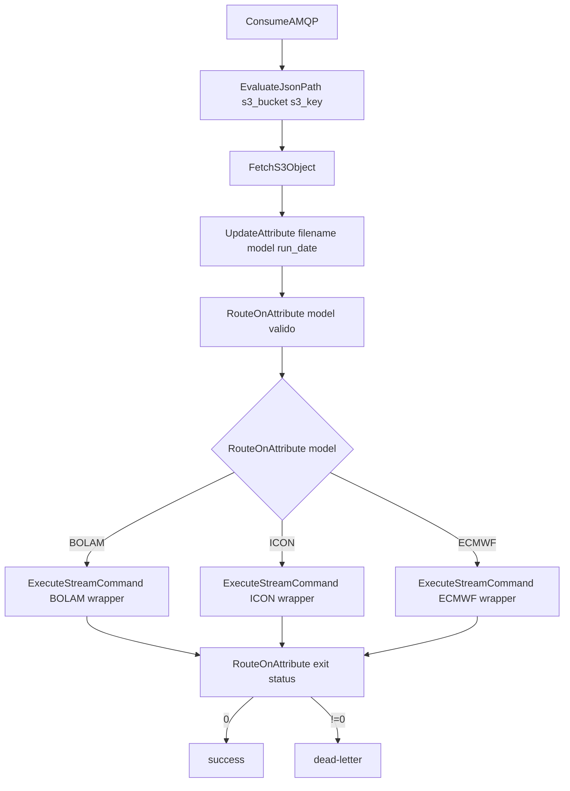

# Guida passo-passo - Workflow NiFi MER

Guida per costruire da zero il flusso NiFi che ingesta i pacchetti MER (BOLAM,
ECMWF, ICON) da S3/MinIO, pubblica i dati raw, genera mappe GeoTIFF e timeseries
delle stazioni, e notifica GeoServer.

## 1. Flusso NiFi attuale

Workflow dichiarato e in uso:

1. Ricezione notifica S3 via AMQP.
2. Parse JSON evento per estrarre bucket e key.
3. Fetch oggetto ZIP da S3.
4. Estrazione `model` dal nome file (`MODEL_YYYYMMDD.zip`) e validazione.
5. Routing su tre rami paralleli (uno per modello) con `ExecuteStreamCommand` dedicato.
6. Gestione errore basata sui codici di uscita (`nonzero status`).



Nota: i tre rami sono paralleli a livello NiFi e permettono di non serializzare elaborazioni lunghe (mappe ~15 minuti).

## 2. Prerequisiti filesystem

Path usati dal manager:

- `/opt/nifi/MER/netcdf_extraction/<YYYYMMDD>/<MODEL>` per NetCDF raw pubblicati.
- `/opt/nifi/MER/maps/<MODEL>/wl` per mappe GeoTIFF.
- `/opt/nifi/MER/maps/<MODEL>/json` per timeseries JSON.
- `/opt/nifi/MER/work_dir/station_list_MER.txt` per lista stazioni.

Assicurare mount e permessi di scrittura nel container NiFi.

## 3. Wrapper shell: parametri disponibili

Wrapper usato da `ExecuteStreamCommand`:

- `/home/nifi/ingest/forecasts/MER_refactored_inprocess/mer_workflow_manager_wrapper.sh`

Il wrapper:

- prepara variabili ambiente per runtime/conda;
- invoca `mer_workflow_manager.py` passando tutti gli argomenti (`"$@"`).

### 3.1 Parametri posizionali (CLI)

Parametri accettati dal wrapper (forward al manager):

- `arg1`: `s3_key` (obbligatorio), ad esempio `BOLAM_20260630.zip` oppure `path/in/bucket/BOLAM_20260630.zip`.

Input aggiuntivo obbligatorio:

- stdin deve contenere i bytes dello ZIP (FlowFile content da `FetchS3Object`).

Configurazione NiFi necessaria nel processore:

- `Ignore STDIN = false`
- `Argument Delimiter = ;`
- Command Path: `bash`
- Command Arguments:
  `/home/nifi/ingest/forecasts/MER_refactored_inprocess/mer_workflow_manager_wrapper.sh;${s3_key}`

### 3.2 Parametri via variabili ambiente

Variabili supportate dal wrapper (con motivazione verificata dal codice):

| Variabile                 | Default                               | Valori utili                  | Perche' esiste / effetto reale                                                                                                                                                                                                                                                           |
| ------------------------- | ------------------------------------- | ----------------------------- | ---------------------------------------------------------------------------------------------------------------------------------------------------------------------------------------------------------------------------------------------------------------------------------------- |
| `MER_TASK_EXECUTION_MODE` | `process`                             | `process`, `thread`, `serial` | Controlla come il manager esegue i task NetCDF (`publish_maps`, `publish_timeseries_*`) dopo `publish_raw`. In `process` usa `ProcessPoolExecutor`, in `thread` usa `ThreadPoolExecutor`, in `serial` disattiva il parallelismo interno. Serve per bilanciare tempo totale e stabilita'. |
| `MER_NETCDF_MAX_WORKERS`  | `2`                                   | intero >= 1                   | Limita quanti processi paralleli NetCDF vengono avviati in mode `process` (`min(configurato, numero task)`). Serve a evitare oversubscription CPU/RAM e ridurre il rischio di contention quando girano piu' run/modelli insieme.                                                         |
| `MER_MAP_WRITE_WORKERS`   | `2`                                   | intero >= 1                   | Controlla il parallelismo della sola scrittura dei GeoTIFF dentro `water_level_processor.py` (thread pool dedicato). Il codice mantiene anche una coda bounded (`write_workers * 2`) per non far crescere memoria senza controllo. Serve a ridurre il tempo I/O delle mappe.             |
| `MER_MAP_TIFF_COMPRESS`   | `DEFLATE`                             | `DEFLATE`, `LZW`, ...         | Override del parametro `compress` del profilo GeoTIFF usato da rasterio. Serve per scegliere trade-off tra velocita' di scrittura e dimensione file.                                                                                                                                     |
| `MER_MAP_TIFF_PREDICTOR`  | `2`                                   | vuoto oppure intero           | Se valorizzato, imposta il campo `predictor` del profilo GeoTIFF; se non numerico viene ignorato. Serve come tuning di compressione, soprattutto su raster float.                                                                                                                        |
| `MER_CRASH_LOG_PATH`      | `/tmp/mer_workflow_manager_crash.log` | path filesystem               | Path del file su cui `faulthandler` scrive dump diagnostici per crash nativi (es. segfault/exit 139). Non e' parametro prestazionale ma di troubleshooting.                                                                                                                              |

Nota su conda/proj nel wrapper:

- `CONDA_DIR` e `CONDA_ECCODES_ENV` sono usati per invocare il Python dell'env corretto.
- `PROJ_DATA` punta al database PROJ dell'env, necessario alle librerie geospaziali quando fanno operazioni CRS/proiezioni.

### 3.3 Script usati nel flusso (in breve)

- `mer_workflow_manager_wrapper.sh`: entrypoint chiamato da NiFi; prepara environment (conda/proj, variabili tuning) e avvia il manager Python.
- `mer_workflow_manager.py`: orchestratore principale; valida input ZIP, classifica la run (`new/current/past`), pianifica task, raccoglie esiti e gestisce marker READY.
- `mer_publish_maps.py`: genera e pubblica le mappe GeoTIFF (ramo assim), con attesa marker `GEOSERVER.READY` nel caso `current`.
- `mer_publish_timeseries.py`: genera e pubblica i JSON di timeseries stazioni per varianti `assim` e/o `noassim`.
- `mer_inspect_netcdf.py`: ispeziona i NetCDF per calcolare metadati temporali usati dal processing (offset e numero timestep validi).
- `water_level_processor.py`: motore numerico/geospaziale che crea GeoTIFF e timeseries a partire dai NetCDF.

## 4. Attributi NiFi usati

Dal messaggio AMQP/S3:

- `s3_bucket = $.Records[0].s3.bucket.name`
- `s3_key = $.Records[0].s3.object.key`

Derivati:

- `filename = ${s3_key:substringAfterLast('/')}`
- `model = ${filename:substringBefore('_')}`
- `run_date = ${filename:substringAfter('_'):substringBefore('.')}`

Validazione model:

- `${model:in('BOLAM','ICON','ECMWF')}`

## 5. Output manager e gestione errori

Il manager emette su stdout un JSON summary singolo (`event_type = summary`) con dettagli step/task.

Nel summary e' presente il campo top-level `warnings` (array di messaggi testuali):

- `warnings = []` quando non ci sono warning;
- `warnings` valorizzato quando ci sono warning non bloccanti (es. uno tra `*_assim.nc` e `*_noassim.nc` mancante, oppure fallback offset stazioni a zero).

Con `EvaluateJsonPath` puoi estrarre `$.warnings` e instradare con `RouteOnAttribute` i casi warning-only separandoli da `degraded` e dai fallimenti.

Nel flusso attuale, la gestione errori e' basata sui return code del processore:

- `0`: successo
- `!=0`: errore (instradare a dead-letter)

Exit code applicativi principali:

- `20`: input non valido (argomenti, filename ZIP, zip corrotto, stdin vuoto)
- `31`: nessun NetCDF nello ZIP
- `22`: errore publish raw
- `23`: errore processing mappe/timeseries
- `25`: errore gestione marker READY

## 6. Comportamento interno del manager

Classificazione run:

- `new`: nessun `<YYYYMMDD>.READY` o `run_date` maggiore dell'ultimo READY
- `current`: `run_date` uguale all'ultimo READY
- `past`: `run_date` minore dell'ultimo READY

Task interni:

- `publish_raw` parte sempre: copia in output i NetCDF presenti nello ZIP (`*_assim.nc` e/o `*_noassim.nc`).
- `publish_maps` parte solo quando la run e' `new` o `current` e quando esiste il file assim (`has_assim=true`): le mappe vengono generate esclusivamente dalla sorgente assim.
- `publish_timeseries_assim` parte per run non `past` quando esiste il file assim: produce la serie stazioni del ramo assim.
- `publish_timeseries_noassim` parte per run non `past` quando esiste il file noassim: produce la serie stazioni del ramo noassim.

In pratica:

- run `past`: viene eseguito solo `publish_raw` (niente mappe, niente nuove timeseries);
- run `new/current`: oltre a `publish_raw`, vengono avviati i task disponibili in base ai file realmente presenti nello ZIP.

Marker READY:

- `new` + mappe ok: reset marker e creazione `<run_date>.READY`
- `current` + mappe ok: rimozione `<run_date>.GEOSERVER.READY` per triggerare nuovamente l'ingestion in geoserver

Wait su `GEOSERVER.READY` (caso `run_class = current`):

- prima di pubblicare/sostituire le mappe, il task `publish_maps` attende la presenza del marker `<run_date>.GEOSERVER.READY`;
- questo comportamento serve a ridurre il rischio di sovrascrivere i file mentre GeoServer sta ancora acquisendo la versione precedente dalla cartella `wl`;
- il wait e' interno allo script (non un loop NiFi) con check periodico: timeout 30s, intervallo 10s, massimo 3 retry;
- se la condizione non viene soddisfatta nei limiti sopra, il task fallisce e il manager ritorna errore.

## 7. Esempio test locale

```bash
cat BOLAM_20260630.zip | /home/nifi/ingest/forecasts/MER_refactored_inprocess/mer_workflow_manager_wrapper.sh BOLAM_20260630.zip
```

## 8. Cleanup periodico output pubblicati

Per la pulizia periodica degli output pubblicati e' disponibile lo script:

- `projects/mistral/nifi/scripts/forecasts/MER/mer_daily_cleanup.py`

Uso consigliato da NiFi (`ExecuteStreamCommand`):

- `mer_daily_cleanup.py <retention_days> [--dry-run]`

Comportamento principale:

- Pulizia su base `mtime` (coerente) per `json` e `wl`.
- I JSON della run corrente (determinata dal marker `<YYYYMMDD>.READY`) sono protetti.
- Modalita' WL `conservative` quando manca la coppia marker corrente `READY + GEOSERVER.READY`: rimuove solo artefatti temporanei vecchi (`.maps_publish_bak`, `.*.tmp`).
- Modalita' WL `aggressive` quando la coppia marker corrente e' presente: puo' eliminare file canonici WL vecchi per `mtime` (incluso `timeregex.properties`).
- Pulizia opzionale del crash log manager (`MER_CRASH_LOG_PATH`, default `/tmp/mer_workflow_manager_crash.log`) con la stessa retention `mtime`.

Output per NiFi:

- Lo script emette sempre un JSON singolo su stdout (`event_type=mer_daily_cleanup_summary`) con dettagli per modello, conteggi (`deleted`, `kept_*`, `errors`) e `status` complessivo.

Nota di consistenza:

- Le costanti condivise (`MAPS_ROOT`, `MAPS_MAX_TIMESTEP`, `CRASH_LOG_ENV`, `DEFAULT_CRASH_LOG`) sono importate da `mer_workflow_manager.py` per evitare drift di configurazione.
- In particolare, il path root da pulire non e' passato da NiFi: viene letto da `MAPS_ROOT` nel manager.

## 9. Checklist operativa

- [ ] Parse AMQP -> `s3_bucket` e `s3_key` configurato.
- [ ] `FetchS3Object` eseguito prima di `ExecuteStreamCommand`.
- [ ] Route su `model` con tre rami dedicati (`BOLAM`, `ICON`, `ECMWF`).
- [ ] Ogni ramo usa il wrapper `.sh` (conda environment).
- [ ] `Ignore STDIN = false` su `ExecuteStreamCommand`.
- [ ] Routing errori basato su `nonzero status`.
- [ ] Path target montati/scrivibili in container NiFi.
